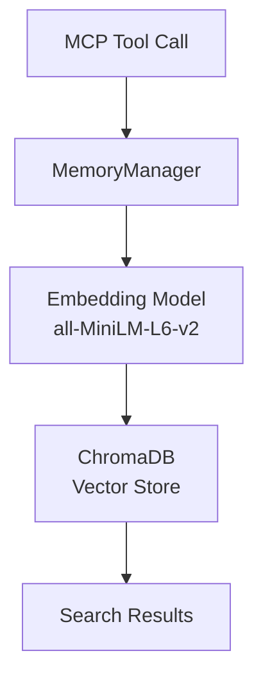
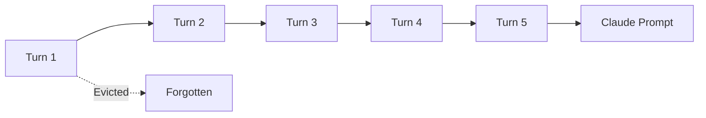

# Memory MCP Tools Reference

Complete documentation for the 3 memory management MCP tools.

## Overview

The Memory MCP Server provides semantic memory storage using ChromaDB. Memories are stored as vector embeddings enabling similarity search.

### Architecture



### Memory Types

| Type | Expiry | Use Case |
|------|--------|----------|
| `fact` | Never | User preferences, important information |
| `conversation` | 30 days | Dialog history, discussions |
| `context` | End of day | Current task, session state |

---

## store_memory

Store a new memory with semantic embedding.

```python
async def store_memory(
    content: str,
    memory_type: str = "fact",
    metadata: dict[str, Any] | None = None,
) -> dict[str, Any]
```

### Parameters

| Parameter | Type | Default | Description |
|-----------|------|---------|-------------|
| `content` | str | (required) | Text content to remember |
| `memory_type` | str | `"fact"` | Memory type: `fact`, `conversation`, or `context` |
| `metadata` | dict | `None` | Optional key-value metadata |

### Memory Type Details

| Type | Expiry | Best For |
|------|--------|----------|
| `fact` | Never expires | "User's name is Alex", "User prefers dark mode" |
| `conversation` | 30 days | "We discussed the project deadline" |
| `context` | End of day | "Currently helping with Python debugging" |

### Returns

**Success:**
```python
{
    "success": True,
    "memory_id": "a1b2c3d4-e5f6-7890-abcd-ef1234567890",
    "content": "User's favorite color is blue",
    "memory_type": "fact",
    "created_at": "2025-01-05T10:30:00Z",
    "expires_at": None  # null for facts
}
```

**Error:**
```python
{
    "success": False,
    "error": "Content cannot be empty"
}
```

### Examples

**Store a permanent fact:**
```python
result = await store_memory(
    content="User's favorite color is blue",
    memory_type="fact"
)
# Returns: {"success": True, "memory_id": "...", "expires_at": None}
```

**Store with metadata:**
```python
result = await store_memory(
    content="User prefers Python over JavaScript",
    memory_type="fact",
    metadata={
        "category": "programming",
        "confidence": "high",
        "source": "explicit_statement"
    }
)
```

**Store conversation context:**
```python
result = await store_memory(
    content="We discussed AI ethics and the importance of alignment",
    memory_type="conversation",
    metadata={"topic": "AI ethics", "date": "2025-01-05"}
)
# Returns: {..., "expires_at": "2025-02-04T10:30:00Z"}  # 30 days
```

**Store session context:**
```python
result = await store_memory(
    content="Currently debugging authentication module",
    memory_type="context",
    metadata={"task": "debugging", "module": "auth"}
)
# Returns: {..., "expires_at": "2025-01-05T23:59:59Z"}  # End of day
```

### Permission

**CONFIRM** - User approval required before storing.

---

## search_memory

Search memories semantically using vector similarity.

```python
async def search_memory(
    query: str,
    memory_type: str | None = None,
    limit: int = 5,
    min_score: float = 0.3,
) -> dict[str, Any]
```

### Parameters

| Parameter | Type | Default | Description |
|-----------|------|---------|-------------|
| `query` | str | (required) | Search query text |
| `memory_type` | str | `None` | Optional filter: `fact`, `conversation`, `context` |
| `limit` | int | `5` | Maximum results to return |
| `min_score` | float | `0.3` | Minimum relevance score (0-1) |

### How Search Works

1. Query text is embedded using `all-MiniLM-L6-v2` (384 dimensions)
2. ChromaDB finds similar vectors using cosine similarity
3. Results filtered by type (if specified) and minimum score
4. Results sorted by relevance score (highest first)

### Returns

**Success:**
```python
{
    "success": True,
    "query": "color preferences",
    "results_count": 2,
    "results": [
        {
            "memory_id": "abc123...",
            "content": "User's favorite color is blue",
            "memory_type": "fact",
            "score": 0.92,
            "created_at": "2025-01-05T10:30:00Z",
            "metadata": {"category": "preferences"}
        },
        {
            "memory_id": "def456...",
            "content": "User mentioned liking blue and green",
            "memory_type": "conversation",
            "score": 0.78,
            "created_at": "2025-01-04T15:20:00Z",
            "metadata": {}
        }
    ]
}
```

**No results:**
```python
{
    "success": True,
    "query": "quantum physics",
    "results_count": 0,
    "results": []
}
```

**Error:**
```python
{
    "success": False,
    "error": "Query cannot be empty",
    "results": []
}
```

### Examples

**Basic search:**
```python
result = await search_memory(query="user preferences")
for r in result["results"]:
    print(f"[{r['score']:.2f}] {r['content']}")
```

**Search with type filter:**
```python
# Only search fact memories
result = await search_memory(
    query="programming languages",
    memory_type="fact",
    limit=3
)
```

**High relevance only:**
```python
# Only return very relevant results
result = await search_memory(
    query="favorite food",
    min_score=0.8
)
```

**Search conversations:**
```python
result = await search_memory(
    query="discussions about AI",
    memory_type="conversation",
    limit=10
)
```

### Search Tips

1. **Use natural language** - "What does the user like?" works well
2. **Be specific** - "favorite programming language" > "programming"
3. **Filter by type** when you know what you're looking for
4. **Adjust min_score** based on how strict you want matching

### Permission

**AUTONOMOUS** - No user approval required.

---

## forget_memory

Delete a specific memory by ID.

```python
async def forget_memory(memory_id: str) -> dict[str, Any]
```

### Parameters

| Parameter | Type | Description |
|-----------|------|-------------|
| `memory_id` | str | UUID of the memory to delete |

### Returns

**Success:**
```python
{
    "success": True,
    "memory_id": "abc123...",
    "message": "Memory deleted"
}
```

**Not found:**
```python
{
    "success": False,
    "memory_id": "xyz789...",
    "message": "Memory not found"
}
```

### Example

```python
# First, find the memory to delete
results = await search_memory(query="outdated information")

if results["results"]:
    memory_id = results["results"][0]["memory_id"]
    result = await forget_memory(memory_id=memory_id)
    print(result["message"])  # "Memory deleted"
```

### Permission

**CONFIRM** - User approval required before deleting.

---

## Python API

### MemoryManager Class

For direct Python access without MCP:

```python
from reachy_agent.memory.manager import MemoryManager, MemoryType

# Initialize
manager = MemoryManager(
    persist_path="~/.reachy/memory",
    context_window_size=5
)

# Store
memory = await manager.store(
    content="User prefers morning meetings",
    memory_type=MemoryType.FACT,
    metadata={"category": "scheduling"}
)

# Search
results = await manager.search(
    query="meeting preferences",
    memory_type=MemoryType.FACT,
    limit=5,
    min_score=0.3
)

# Delete
success = await manager.forget(memory_id="abc123...")

# Context window
manager.add_to_context_window("user", "Hello!")
manager.add_to_context_window("assistant", "Hi there!")
context = manager.get_context_window()  # Last N turns
```

### Memory Data Class

```python
from dataclasses import dataclass
from datetime import datetime
from reachy_agent.memory.manager import MemoryType

@dataclass
class Memory:
    id: str
    content: str
    memory_type: MemoryType
    created_at: datetime
    metadata: dict[str, Any]

    @property
    def expires_at(self) -> datetime | None:
        """Compute expiry based on type."""
        ...
```

### SearchResult Data Class

```python
@dataclass
class SearchResult:
    memory: Memory
    score: float  # 0-1, higher = more relevant
```

---

## Context Window

The agent maintains an automatic context window of recent conversation turns.

### How It Works



### API

```python
# Add turns
manager.add_to_context_window("user", "What's the weather?")
manager.add_to_context_window("assistant", "I don't have weather data.")

# Get recent context
context = manager.get_context_window()
# Returns: [
#   {"role": "user", "content": "...", "timestamp": "..."},
#   {"role": "assistant", "content": "...", "timestamp": "..."},
#   ...
# ]

# Clear (new session)
manager.clear_context_window()
```

### Configuration

```yaml
memory:
  context_window_size: 5  # Number of turns to keep
```

---

## Storage

### Location

Memories persist at:
```
~/.reachy/memory/chroma.sqlite3
```

### Backup

```bash
# Backup
cp -r ~/.reachy/memory ~/.reachy/memory-backup

# Restore
cp -r ~/.reachy/memory-backup ~/.reachy/memory
```

### Reset

```bash
rm -rf ~/.reachy/memory
# Memories will be reinitialized on next start
```

---

## Configuration

```yaml
memory:
  path: ~/.reachy/memory
  context_window_size: 5
  embedding_model: all-MiniLM-L6-v2
  cleanup_interval: 3600  # Run cleanup every hour
```

---

## Cleanup

Expired memories are automatically cleaned up:

- **On startup** - Old memories removed
- **Periodically** - Based on `cleanup_interval`

Manual cleanup:
```python
deleted_count = await manager.cleanup_expired()
print(f"Cleaned up {deleted_count} expired memories")
```

---

## Best Practices

### 1. Choose the Right Type

| Scenario | Type |
|----------|------|
| User preference | `fact` |
| Important information | `fact` |
| Past conversation topic | `conversation` |
| Current task | `context` |

### 2. Add Useful Metadata

```python
# Good metadata
await store_memory(
    content="User is allergic to peanuts",
    memory_type="fact",
    metadata={
        "category": "health",
        "importance": "critical",
        "source": "user_stated"
    }
)
```

### 3. Search Before Storing

Avoid duplicates by checking first:
```python
existing = await search_memory(query="user's name", memory_type="fact")
if not existing["results"]:
    await store_memory(content="User's name is Alex", memory_type="fact")
```

### 4. Use Specific Content

```python
# Good - specific and searchable
"User Alex prefers dark mode in all applications"

# Bad - too vague
"User likes dark"
```
