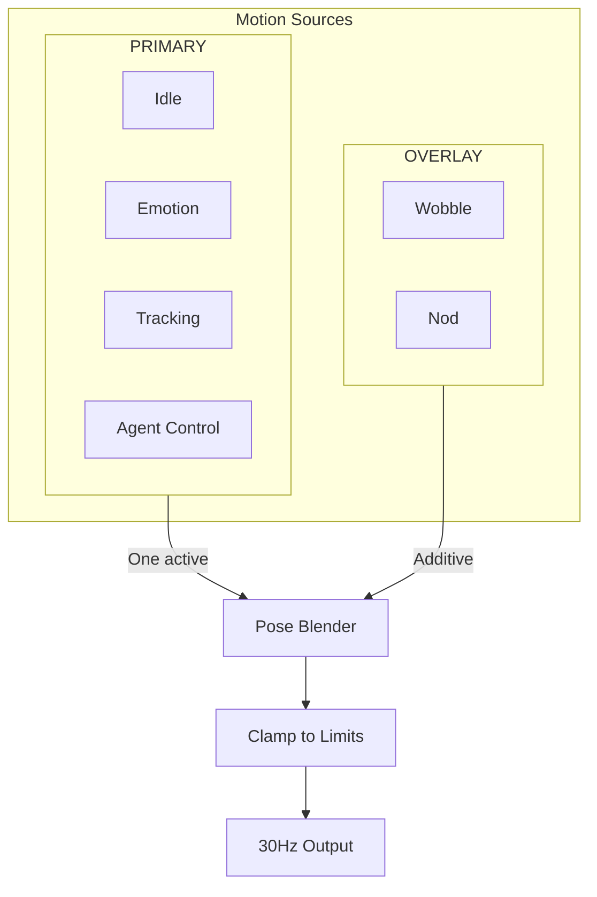

# Motion Control API Reference

30Hz blend controller for smooth robot motion.

## Overview

The motion control system orchestrates robot movement using a blend controller. Two source types compete/combine: PRIMARY (idle behavior, emotions) and OVERLAY (speech wobble).



---

## BlendController Class

Main motion coordinator running at 30Hz.

```python
from reachy_agent.motion.controller import BlendController

class BlendController:
    TICK_HZ = 30
    TICK_INTERVAL = 1.0 / TICK_HZ  # ~33ms

    def __init__(self, client: ReachyClient):
        """
        Create blend controller.

        Args:
            client: Robot client for sending commands
        """
        ...

    async def start(self) -> None:
        """Start the motion control loop."""
        ...

    async def stop(self) -> None:
        """Stop the motion control loop."""
        ...

    async def set_primary(self, source: MotionSource) -> None:
        """
        Set the PRIMARY motion source.
        Replaces any existing PRIMARY source.
        """
        ...

    async def add_overlay(self, source: MotionSource) -> None:
        """Add an OVERLAY motion source (additive)."""
        ...

    async def remove_overlay(self, name: str) -> None:
        """Remove an OVERLAY motion source by name."""
        ...
```

### Usage

```python
from reachy_agent.motion.controller import BlendController
from reachy_agent.motion.idle import IdleBehavior
from reachy_agent.motion.wobble import SpeechWobble

# Create controller
controller = BlendController(robot_client)

# Start motion loop
await controller.start()

# Set idle as primary behavior
await controller.set_primary(IdleBehavior())

# Add speech wobble when speaking
await controller.add_overlay(SpeechWobble())

# Remove wobble when done speaking
await controller.remove_overlay("wobble")

# Stop
await controller.stop()
```

---

## Data Types

### HeadPose

Absolute head position.

```python
from dataclasses import dataclass

@dataclass
class HeadPose:
    pitch: float = 0.0  # degrees, -45 to +35
    yaw: float = 0.0    # degrees, -60 to +60
    roll: float = 0.0   # degrees, -35 to +35
    z: float = 0.0      # mm, 0 to 50
```

### PoseOffset

Offset to add to base pose (for OVERLAY sources).

```python
@dataclass
class PoseOffset:
    pitch: float = 0.0
    yaw: float = 0.0
    roll: float = 0.0
    z: float = 0.0
```

### AntennaState

Antenna positions.

```python
@dataclass
class AntennaState:
    left: float = 0.0   # degrees, -150 to +150
    right: float = 0.0  # degrees, -150 to +150
```

### MotionSourceType

Enum for source types.

```python
from enum import Enum

class MotionSourceType(Enum):
    PRIMARY = "primary"   # Mutually exclusive
    OVERLAY = "overlay"   # Additive
```

### MotionOutput

Output from a motion source.

```python
@dataclass
class MotionOutput:
    head: HeadPose | PoseOffset
    antennas: AntennaState | None = None
    body_angle: float | None = None  # Only PRIMARY can set body
```

---

## MotionSource Protocol

Interface for all motion sources.

```python
from typing import Protocol

class MotionSource(Protocol):
    @property
    def name(self) -> str:
        """Unique identifier."""
        ...

    @property
    def source_type(self) -> MotionSourceType:
        """PRIMARY or OVERLAY."""
        ...

    @property
    def is_active(self) -> bool:
        """Whether currently producing output."""
        ...

    async def start(self) -> None:
        """Called when source becomes active."""
        ...

    async def stop(self) -> None:
        """Called when source is deactivated."""
        ...

    def tick(self) -> MotionOutput | None:
        """Called at 30Hz. Returns motion output or None."""
        ...
```

---

## Built-in Sources

### IdleBehavior (PRIMARY)

Look-around behavior using Perlin noise.

```python
from reachy_agent.motion.idle import IdleBehavior

class IdleBehavior:
    def __init__(
        self,
        speed: float = 0.1,        # Movement speed
        amplitude: float = 0.3,    # Movement range (fraction of limits)
        antenna_drift: float = 0.2  # Antenna variation
    ):
        ...
```

**Usage:**
```python
idle = IdleBehavior(speed=0.15, amplitude=0.4)
await controller.set_primary(idle)
```

**Behavior:**
- Smooth, organic head movement
- Subtle antenna variations
- Creates "alive" feeling
- Uses Perlin noise for natural motion

### SpeechWobble (OVERLAY)

Audio-reactive head movement during speech.

```python
from reachy_agent.motion.wobble import SpeechWobble

class SpeechWobble:
    def __init__(
        self,
        intensity: float = 1.0,  # Amplitude multiplier
        frequency: float = 4.0   # Oscillation Hz
    ):
        ...

    def set_audio_level(self, level: float) -> None:
        """Set current audio level (0-1) for reactivity."""
        ...
```

**Usage:**
```python
wobble = SpeechWobble(intensity=1.2)
await controller.add_overlay(wobble)

# Update with audio level while speaking
wobble.set_audio_level(0.8)  # Called at audio rate

# Remove when done
await controller.remove_overlay("wobble")
```

### EmotionPlayback (PRIMARY)

Play recorded emotion from library.

```python
from reachy_agent.motion.emotion import EmotionPlayback

class EmotionPlayback:
    def __init__(self, emotion_data: dict):
        """
        Create from emotion data.

        Args:
            emotion_data: Dict with "frames" and optional "fps"
        """
        ...
```

**Usage:**
```python
import json

# Load emotion
with open("data/emotions/happy.json") as f:
    emotion_data = json.load(f)

playback = EmotionPlayback(emotion_data)
await controller.set_primary(playback)

# Wait for completion
while playback.is_active:
    await asyncio.sleep(0.1)

# Return to idle
await controller.set_primary(IdleBehavior())
```

### EmotionSequence (PRIMARY)

Chain multiple emotions.

```python
from reachy_agent.motion.emotion import EmotionSequence

class EmotionSequence:
    def __init__(
        self,
        emotions: list[str],           # Emotion names
        delays: list[float] | None = None  # Delays between (default 0.5s)
    ):
        ...
```

**Usage:**
```python
sequence = EmotionSequence(
    emotions=["curious", "thinking", "happy"],
    delays=[0.5, 0.3]
)
await controller.set_primary(sequence)
```

---

## Creating Custom Sources

### Custom PRIMARY Source

```python
import math
from reachy_agent.motion.controller import (
    HeadPose, AntennaState, MotionOutput, MotionSourceType
)

class ScanningBehavior:
    """Custom scanning idle behavior."""

    name = "scanning"
    source_type = MotionSourceType.PRIMARY

    def __init__(self, scan_speed: float = 0.3):
        self._speed = scan_speed
        self._active = False
        self._time = 0.0

    @property
    def is_active(self) -> bool:
        return self._active

    async def start(self) -> None:
        self._active = True
        self._time = 0.0

    async def stop(self) -> None:
        self._active = False

    def tick(self) -> MotionOutput | None:
        if not self._active:
            return None

        self._time += 1.0 / 30.0  # 30Hz

        # Scan left-right
        yaw = math.sin(self._time * self._speed * 2 * math.pi) * 40

        return MotionOutput(
            head=HeadPose(pitch=0, yaw=yaw, roll=0, z=0),
            antennas=AntennaState(left=yaw * 0.3, right=yaw * 0.3)
        )
```

### Custom OVERLAY Source

```python
from reachy_agent.motion.controller import PoseOffset, MotionOutput, MotionSourceType

class BreathingOverlay:
    """Subtle breathing motion."""

    name = "breathing"
    source_type = MotionSourceType.OVERLAY

    def __init__(self, rate: float = 0.2):
        self._rate = rate
        self._active = False
        self._time = 0.0

    @property
    def is_active(self) -> bool:
        return self._active

    async def start(self) -> None:
        self._active = True
        self._time = 0.0

    async def stop(self) -> None:
        self._active = False

    def tick(self) -> MotionOutput | None:
        if not self._active:
            return None

        self._time += 1.0 / 30.0
        breath = (math.sin(self._time * self._rate * 2 * math.pi) + 1) / 2

        return MotionOutput(
            head=PoseOffset(z=breath * 3)  # Subtle Z movement
        )
```

---

## Blend Algorithm

```python
def blend_tick(self) -> HeadPose:
    # 1. Get PRIMARY output (base pose)
    primary_output = None
    if self._primary and self._primary.is_active:
        primary_output = self._primary.tick()

    if not primary_output:
        return HeadPose()  # Neutral

    base_pose = primary_output.head

    # 2. Sum all OVERLAY outputs
    offset = PoseOffset()
    for overlay in self._overlays.values():
        if overlay.is_active:
            output = overlay.tick()
            if output and isinstance(output.head, PoseOffset):
                offset.pitch += output.head.pitch
                offset.yaw += output.head.yaw
                offset.roll += output.head.roll
                offset.z += output.head.z

    # 3. Apply offset to base
    final = HeadPose(
        pitch=base_pose.pitch + offset.pitch,
        yaw=base_pose.yaw + offset.yaw,
        roll=base_pose.roll + offset.roll,
        z=base_pose.z + offset.z
    )

    # 4. Clamp to limits
    return self._clamp(final)
```

---

## Hardware Limits

Applied automatically:

```python
LIMITS = {
    "pitch": (-45, 35),
    "yaw": (-60, 60),
    "roll": (-35, 35),
    "z": (0, 50),
}

def _clamp(self, pose: HeadPose) -> HeadPose:
    return HeadPose(
        pitch=max(-45, min(35, pose.pitch)),
        yaw=max(-60, min(60, pose.yaw)),
        roll=max(-35, min(35, pose.roll)),
        z=max(0, min(50, pose.z))
    )
```

---

## Configuration

```yaml
motion:
  tick_hz: 30
  idle:
    speed: 0.1
    amplitude: 0.3
    antenna_drift: 0.2
  wobble:
    intensity: 1.0
    frequency: 4.0
```

---

## Integration with Voice

The motion system integrates with voice events:

```python
from reachy_agent.voice.pipeline import VoicePipeline
from reachy_agent.motion.controller import BlendController
from reachy_agent.motion.wobble import SpeechWobble

async def setup_voice_motion(pipeline: VoicePipeline, controller: BlendController):

    @pipeline.on("speaking_start")
    async def on_speak(event):
        await controller.add_overlay(SpeechWobble())

    @pipeline.on("speaking_end")
    async def on_speak_end(event):
        await controller.remove_overlay("wobble")

    @pipeline.on("interrupted")
    async def on_interrupt(event):
        await controller.remove_overlay("wobble")
```

---

## Performance

- **Tick Rate**: 30Hz (33ms intervals)
- **Latency**: <1ms per tick (computation only)
- **SDK Latency**: 1-5ms (Zenoh communication)
- **Total**: ~5-10ms from tick to motor command
