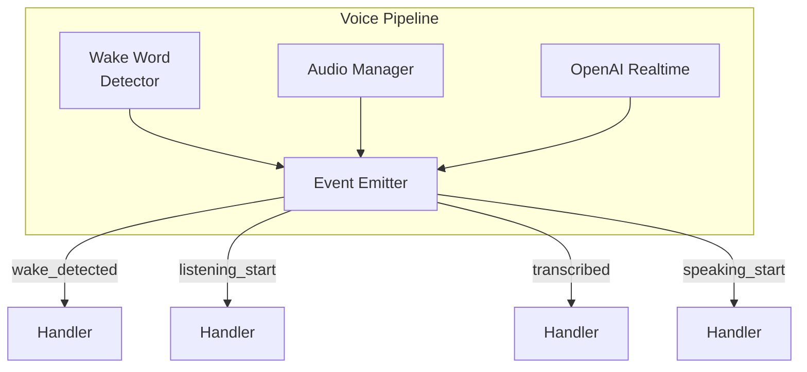

# Voice Pipeline API Reference

Event-driven voice interaction system with wake word detection and barge-in support.

## Overview

The voice pipeline uses an event-driven architecture where each event triggers handlers. This makes debugging easier and behavior extension straightforward.



## VoicePipeline Class

Main pipeline coordinator.

```python
from reachy_agent.voice.pipeline import VoicePipeline

class VoicePipeline(EventEmitter):
    def __init__(
        self,
        agent: ReachyAgentLoop,
        persona_manager: PersonaManager,
        debug: bool = False
    ):
        """
        Create voice pipeline.

        Args:
            agent: Agent loop for processing queries
            persona_manager: Manages persona switching
            debug: Enable detailed event logging
        """
        ...

    async def start(self) -> None:
        """Initialize components and start wake word detection."""
        ...

    async def stop(self) -> None:
        """Stop all components and clean up."""
        ...
```

### Usage

```python
from reachy_agent.voice.pipeline import VoicePipeline
from reachy_agent.voice.persona import PersonaManager

# Create pipeline
persona_manager = PersonaManager()
pipeline = VoicePipeline(
    agent=agent_loop,
    persona_manager=persona_manager,
    debug=True  # Enable event logging
)

# Start listening
await pipeline.start()

# ... pipeline runs ...

# Stop
await pipeline.stop()
```

---

## Events

### Event Flow

```
wake_detected → listening_start → listening_end → transcribed
    → processing → response → speaking_start → speaking_end
```

### Event Reference

#### wake_detected

Triggered when wake word is recognized.

```python
@pipeline.on("wake_detected")
async def handle_wake(event):
    persona = event.data["persona"]     # str: "jarvis", "motoko", etc.
    confidence = event.data["confidence"]  # float: 0.0-1.0
```

#### listening_start

Robot has started listening for speech.

```python
@pipeline.on("listening_start")
async def handle_listening_start(event):
    persona = event.data["persona"]  # Active persona
```

#### listening_end

Robot has stopped listening (silence detected).

```python
@pipeline.on("listening_end")
async def handle_listening_end(event):
    audio_duration = event.data["audio_duration"]  # float: seconds
```

#### transcribed

Speech has been converted to text.

```python
@pipeline.on("transcribed")
async def handle_transcribed(event):
    text = event.data["text"]           # str: transcribed text
    confidence = event.data["confidence"]  # float: 0.0-1.0
```

#### processing

Query is being sent to Claude.

```python
@pipeline.on("processing")
async def handle_processing(event):
    text = event.data["text"]  # User's query
```

#### response

Claude has responded.

```python
@pipeline.on("response")
async def handle_response(event):
    text = event.data["text"]  # Claude's response
```

#### speaking_start

Text-to-speech playback is starting.

```python
@pipeline.on("speaking_start")
async def handle_speaking_start(event):
    text = event.data["text"]   # Text being spoken
    voice = event.data["voice"]  # Voice preset (e.g., "nova")
```

#### speaking_end

Text-to-speech playback completed.

```python
@pipeline.on("speaking_end")
async def handle_speaking_end(event):
    pass  # No data
```

#### interrupted

Speech was interrupted (barge-in).

```python
@pipeline.on("interrupted")
async def handle_interrupted(event):
    by = event.data["by"]  # "wake_word" or "error"
```

#### error

An error occurred.

```python
@pipeline.on("error")
async def handle_error(event):
    error_type = event.data["type"]     # Exception class name
    message = event.data["message"]     # Error message
```

#### timeout

A phase timed out.

```python
@pipeline.on("timeout")
async def handle_timeout(event):
    phase = event.data["phase"]  # "listening", "transcription", etc.
```

---

## EventEmitter Base Class

```python
from dataclasses import dataclass, field
from typing import Callable, Any

@dataclass
class Event:
    name: str
    data: dict[str, Any] = field(default_factory=dict)
    timestamp: float = field(default_factory=time.time)

class EventEmitter:
    def __init__(self, debug: bool = False):
        """Initialize event emitter."""
        ...

    def on(self, event_name: str) -> Callable:
        """
        Decorator to register event handler.

        Example:
            @emitter.on("wake_detected")
            async def handle_wake(event):
                print(f"Wake: {event.data}")
        """
        ...

    async def emit(self, event_name: str, **data) -> None:
        """
        Emit event to all registered handlers.

        Example:
            await emitter.emit("wake_detected", persona="jarvis", confidence=0.87)
        """
        ...
```

### Custom Event Handling

```python
from reachy_agent.voice.pipeline import VoicePipeline

pipeline = VoicePipeline(agent, persona_manager)

# Register custom handlers
@pipeline.on("wake_detected")
async def log_wake(event):
    print(f"[WAKE] {event.data['persona']} (conf: {event.data['confidence']:.2f})")

@pipeline.on("transcribed")
async def process_command(event):
    text = event.data["text"]
    if "stop" in text.lower():
        await pipeline.stop()

@pipeline.on("error")
async def handle_error(event):
    print(f"[ERROR] {event.data['type']}: {event.data['message']}")

await pipeline.start()
```

---

## WakeWordDetector Class

Continuous wake word detection with barge-in support.

```python
from reachy_agent.voice.wake_word import WakeWordDetector

class WakeWordDetector:
    def __init__(
        self,
        models: list[str],
        on_detected: Callable[[str, float], None],
        sensitivity: float = 0.5
    ):
        """
        Create wake word detector.

        Args:
            models: List of wake word model names
            on_detected: Callback(model_name, confidence)
            sensitivity: Detection threshold (0.0-1.0)
        """
        ...

    def enable(self) -> None:
        """Enable detection (always on for barge-in)."""
        ...

    def disable(self) -> None:
        """Disable detection."""
        ...

    async def process_audio(self, audio_chunk: bytes) -> None:
        """Process audio chunk for wake words."""
        ...
```

### Wake Word Models

Default models (from OpenWakeWord):
- `hey_jarvis`
- `hey_motoko`
- `hey_batou`

Custom models can be trained and added.

---

## PersonaManager Class

Manages persona discovery and switching.

```python
from reachy_agent.voice.persona import PersonaManager, Persona

@dataclass
class Persona:
    name: str           # "Jarvis"
    wake_word: str      # "hey_jarvis"
    voice: str          # "echo"
    system_prompt: str  # Full system prompt

class PersonaManager:
    def __init__(self, personas_dir: Path = Path("prompts/personas")):
        """Auto-discover personas from directory."""
        ...

    def get_wake_models(self) -> list[str]:
        """Get list of wake word models for all personas."""
        ...

    def persona_for_model(self, model: str) -> str:
        """Get persona name for wake word model."""
        ...

    def get_voice(self, persona: str) -> str:
        """Get TTS voice for persona."""
        ...

    async def switch_to(self, persona: str) -> None:
        """Switch active persona."""
        ...
```

### Persona File Format

```markdown
---
name: Jarvis
wake_word: hey_jarvis
voice: echo
---

# Jarvis

You are Jarvis, a helpful AI assistant...
[system prompt content]
```

### Creating Custom Personas

```markdown
# prompts/personas/custom.md
---
name: CustomBot
wake_word: hey_custom
voice: nova
---

# CustomBot

You are CustomBot, with these traits:
- Friendly and helpful
- Expert in robotics
- Slightly quirky sense of humor
```

---

## AudioManager Class

Handles audio capture and playback.

```python
from reachy_agent.voice.audio import AudioManager

class AudioManager:
    SAMPLE_RATE = 16000   # Input
    OUTPUT_RATE = 24000   # Output (OpenAI)
    CHANNELS = 1
    CHUNK_SIZE = 1024
    FORMAT = pyaudio.paInt16

    async def initialize(self) -> None:
        """Initialize PyAudio."""
        ...

    def start_capture(self) -> None:
        """Start audio capture."""
        ...

    def stop_capture(self) -> bytes:
        """Stop capture and return audio data."""
        ...

    def play_chunk(self, audio: bytes) -> None:
        """Play audio chunk."""
        ...

    def cleanup(self) -> None:
        """Clean up audio resources."""
        ...
```

---

## OpenAIRealtimeClient Class

WebSocket client for OpenAI Realtime API.

```python
from reachy_agent.voice.realtime import OpenAIRealtimeClient

class OpenAIRealtimeClient:
    async def connect(self) -> None:
        """Connect to OpenAI Realtime API."""
        ...

    async def start_session(self, voice: str = "alloy") -> None:
        """Start a new realtime session with voice."""
        ...

    async def transcribe(self, audio: bytes) -> str:
        """Send audio and get transcription."""
        ...

    async def speak(
        self,
        text: str,
        voice: str,
        on_complete: Callable
    ) -> None:
        """Stream TTS audio."""
        ...

    async def stop_speaking(self) -> None:
        """Cancel current TTS playback."""
        ...

    async def disconnect(self) -> None:
        """Disconnect from API."""
        ...
```

---

## Configuration

```yaml
voice:
  personas: [motoko, batou, jarvis]
  wake_sensitivity: 0.5       # 0.0-1.0
  silence_threshold: 0.3      # Seconds to detect end of speech
  max_listen_time: 30.0       # Maximum listening duration

openai:
  realtime_model: gpt-4o-realtime-preview
```

---

## Debug Mode

Enable detailed logging:

```bash
python -m reachy_agent run --mock --voice --debug-voice
```

Output:
```
[12:34:56.789] voice_event event=wake_detected persona=jarvis confidence=0.87
[12:34:56.792] voice_event event=listening_start persona=jarvis
[12:34:59.123] voice_event event=listening_end audio_duration=2.331
[12:34:59.456] voice_event event=transcribed text="Hello" confidence=0.94
...
```

---

## Error Handling

```python
@pipeline.on("error")
async def handle_error(event):
    error_type = event.data["type"]
    message = event.data["message"]

    if error_type == "ConnectionError":
        # Reconnect logic
        await pipeline.stop()
        await asyncio.sleep(1)
        await pipeline.start()
    elif error_type == "TimeoutError":
        # Reset to listening
        pass
    else:
        # Log and continue
        print(f"Error: {error_type}: {message}")
```

Common errors:
- `ConnectionError`: WebSocket disconnected
- `TimeoutError`: Listening/transcription timeout
- `AudioError`: Microphone/speaker issues
