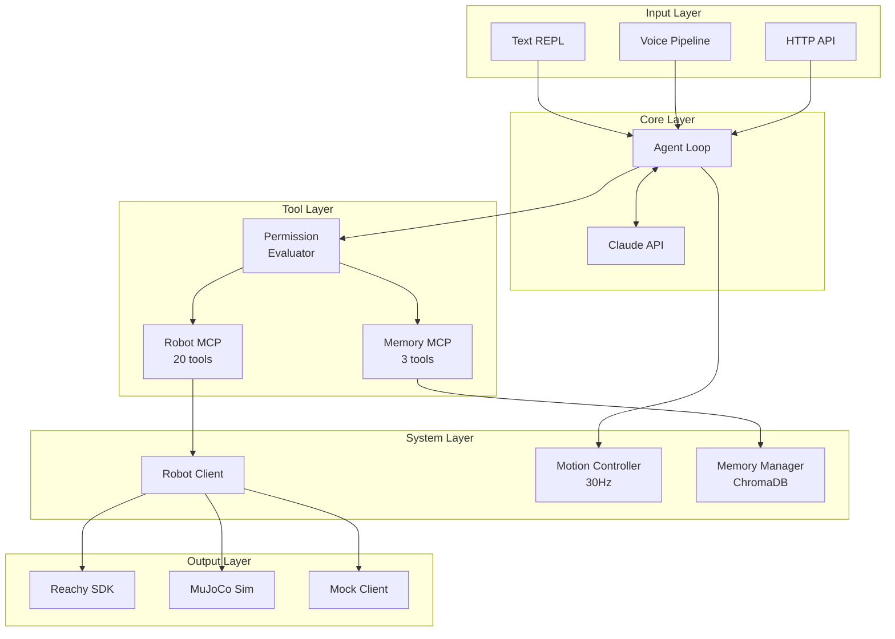
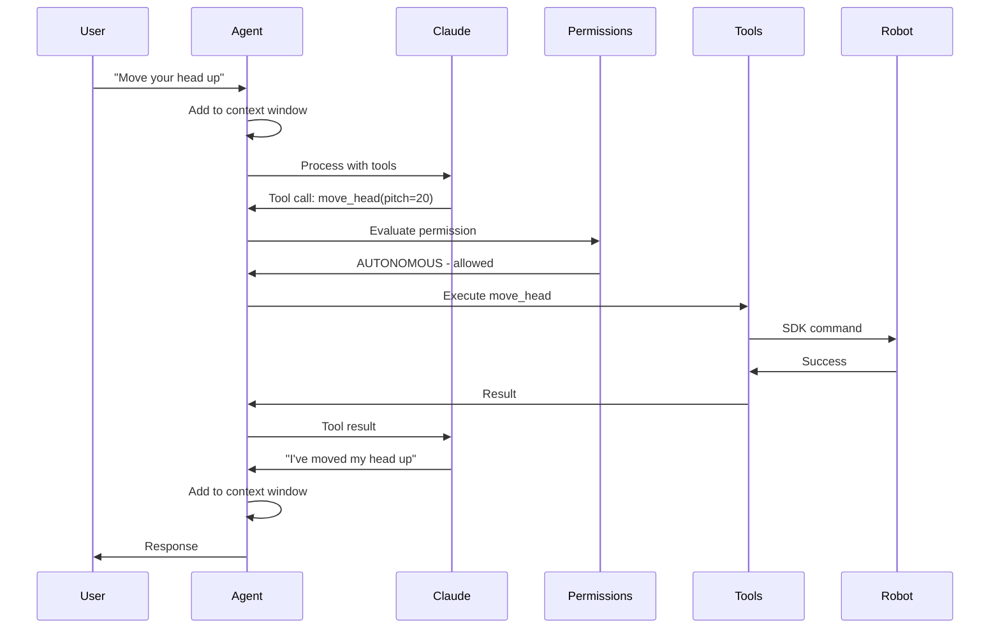
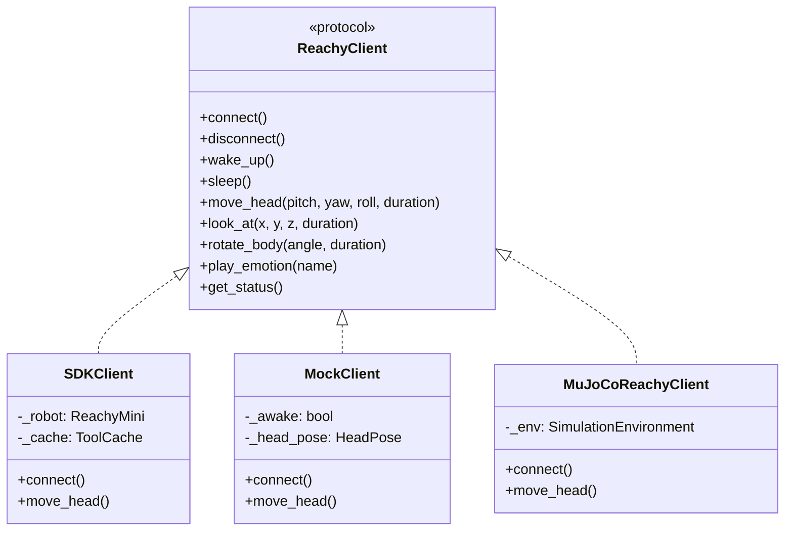
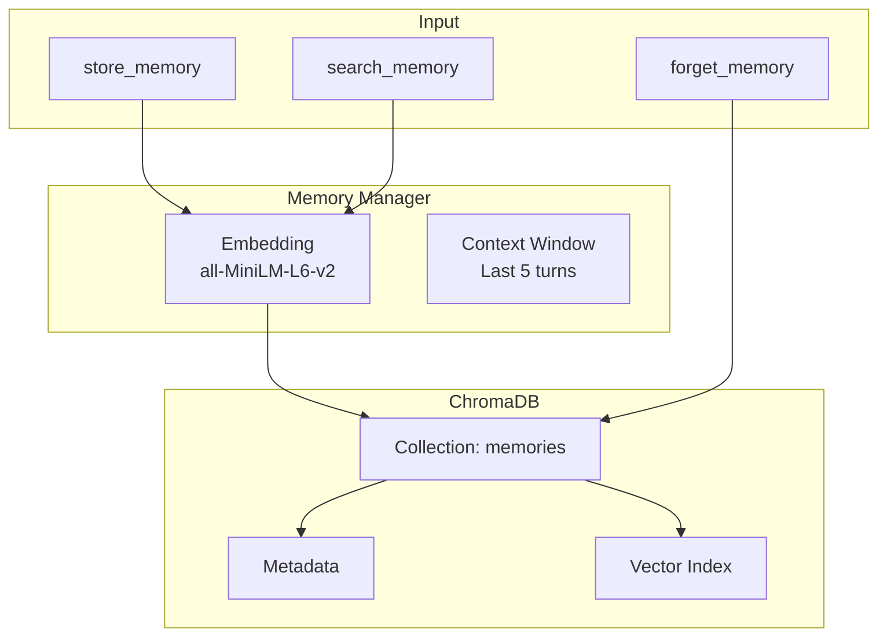
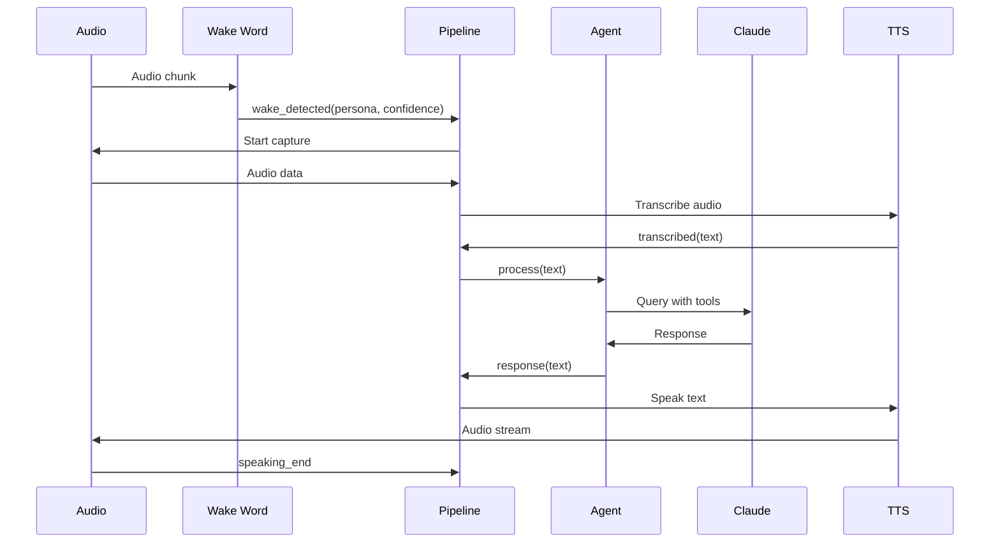
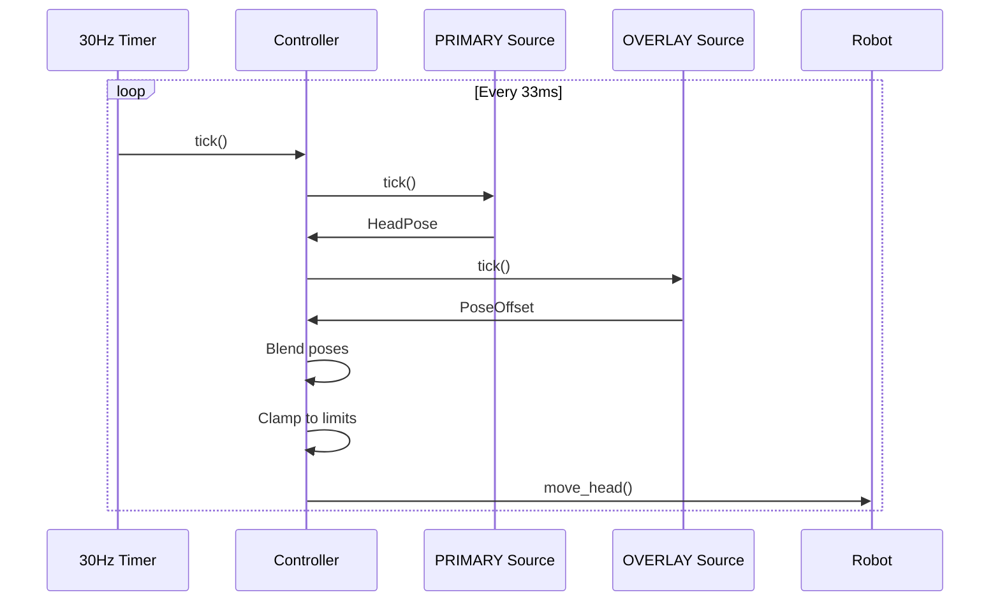

# System Architecture

Deep dive into the system design and component interactions.

## High-Level Architecture



## Design Decisions

### Why Event-Driven Voice (Not State Machine)?

**v1 used a state machine:**
```
IDLE → WAKE_DETECTED → LISTENING → PROCESSING → SPEAKING → IDLE
```

**Problems:**
1. Hard to debug - "What state am I in?"
2. Hard to extend - Adding states requires updating transitions
3. Complex barge-in - Need special handling for interruptions

**v2 uses events:**
```
wake_detected → listening_start → transcribed → response → speaking_start
```

**Benefits:**
1. Easy to debug - Log every event with timestamp
2. Easy to extend - Just add new event handlers
3. Natural barge-in - Events can fire anytime

### Why ChromaDB Only (No SQLite)?

**v1 used ChromaDB + SQLite:**
- ChromaDB for embeddings
- SQLite for user profiles, sessions

**Problems:**
1. Two systems to maintain
2. Data synchronization issues
3. Complex backup/migration

**v2 uses ChromaDB only:**
- User profiles = FACT memories with metadata
- Sessions = CONTEXT memories with expiry
- Single backup: `cp -r ~/.reachy/memory backup/`

### Why 3 Permission Tiers (Not 4)?

**v1 had NOTIFY tier:**
- Execute tool, then show notification

**Problem:** What's the user supposed to do with a notification after the action is done?

**v2 removed NOTIFY:**
- If safe → AUTONOMOUS (just do it)
- If needs oversight → CONFIRM (ask first)
- If forbidden → FORBIDDEN (never)

### Why SDK-Only (No HTTP Fallback)?

**v1 had HTTP fallback:**
- Try SDK first (1-5ms)
- Fall back to HTTP (10-50ms)

**Problems:**
1. HTTP too slow for real-time motion
2. Silent degradation hides issues
3. Complex error handling

**v2 is SDK-only:**
- If SDK fails, fail fast with clear error
- User knows immediately if hardware is disconnected

---

## Component Deep Dives

### Agent Loop



**Key responsibilities:**
1. Manage conversation context window
2. Route requests to Claude
3. Execute tools with permission checks
4. Coordinate voice, motion, memory

**Code structure:**
```python
class ReachyAgentLoop:
    async def process(self, user_input: str) -> str:
        # 1. Add to context window
        self._memory.add_to_context_window("user", user_input)

        # 2. Build messages with context
        messages = self._build_messages(user_input)

        # 3. Call Claude with tools
        response = await self._call_claude(messages)

        # 4. Process tool calls (with permissions)
        while response.stop_reason == "tool_use":
            tool_results = await self._execute_tools(response.content)
            messages.append({"role": "assistant", "content": response.content})
            messages.append({"role": "user", "content": tool_results})
            response = await self._call_claude(messages)

        # 5. Extract and return response
        assistant_text = self._extract_text(response)
        self._memory.add_to_context_window("assistant", assistant_text)
        return assistant_text
```

### Robot Client

**Protocol pattern for multiple implementations:**



**Factory pattern:**
```python
def create_client(backend: Backend) -> ReachyClient:
    match backend:
        case Backend.SDK:
            return SDKClient()
        case Backend.MOCK:
            return MockClient()
        case Backend.SIM:
            return MuJoCoReachyClient()
```

### Memory System



**Memory type expiry:**
```python
@property
def expires_at(self) -> datetime | None:
    match self.memory_type:
        case MemoryType.CONVERSATION:
            return self.created_at + timedelta(days=30)
        case MemoryType.CONTEXT:
            return self.created_at.replace(hour=23, minute=59, second=59)
        case MemoryType.FACT:
            return None  # Never expires
```

### Tool Caching

Read-only tools cache results to avoid redundant SDK calls:

```python
@dataclass
class CachedResult:
    value: Any
    timestamp: float
    ttl: float = 0.2  # 200ms

class ToolCache:
    def get(self, key: str) -> Any | None:
        if key in self._cache:
            entry = self._cache[key]
            if time.time() - entry.timestamp < entry.ttl:
                return entry.value
            del self._cache[key]
        return None

    def invalidate(self, pattern: str = "*"):
        # Movement tools invalidate position cache
        if pattern == "*":
            self._cache.clear()
        else:
            for k in list(self._cache.keys()):
                if k.startswith(pattern.rstrip("*")):
                    del self._cache[k]
```

**Cache TTLs:**
| Tool | TTL | Invalidated By |
|------|-----|----------------|
| `get_status` | 200ms | Any movement |
| `get_position` | 200ms | Any movement |
| `get_limits` | 60s | Never |
| `get_sensor_data` | 100ms | Never |

---

## Data Flow

### Voice Interaction Flow



### Motion Control Flow



---

## Error Handling Strategy

### Fail Fast

```python
# DON'T: Silent fallback
async def connect(self):
    try:
        await self._connect_sdk()
    except:
        await self._connect_http()  # Hidden degradation

# DO: Clear failure
async def connect(self):
    try:
        await self._connect_sdk()
    except ConnectionError as e:
        raise ConnectionError(f"Failed to connect to robot: {e}")
```

### Graceful Recovery

```python
class ReachyAgentLoop:
    async def process(self, user_input: str) -> str:
        try:
            return await self._process_internal(user_input)
        except anthropic.APIError:
            return "I'm having trouble thinking. Let me try again."
        except ConnectionError:
            await self._reconnect_robot()
            return "I lost connection briefly. I'm back now."
        except Exception:
            self._log.exception("unexpected_error")
            return "Something unexpected happened. Could you try again?"
```

### Audit Trail

```python
class AuditLogger:
    def log(self, decision: PermissionDecision, tool_args: dict):
        entry = {
            "timestamp": datetime.utcnow().isoformat(),
            "tool_name": decision.tool_name,
            "tool_args": tool_args,
            "tier": decision.tier.value,
            "allowed": decision.allowed,
        }
        with open(self._path, "a") as f:
            f.write(json.dumps(entry) + "\n")
```

---

## Configuration Architecture

### Convention Over Configuration

```yaml
# BAD: Deeply nested, every option exposed
voice:
  wake_word:
    model_path: /path/to/model
    sample_rate: 16000
    chunk_size: 1024
    threshold: 0.5
    min_duration: 0.1
    max_duration: 3.0
  personas:
    jarvis:
      wake_word: hey_jarvis
      voice: echo
      prompt_path: prompts/jarvis.md

# GOOD: Auto-discover, sensible defaults
voice:
  personas: [jarvis, motoko, batou]  # Auto-discovered from prompts/personas/
  wake_sensitivity: 0.5              # One knob for tuning
```

### Pydantic Validation

```python
from pydantic import BaseModel, Field

class VoiceConfig(BaseModel):
    personas: list[str] = Field(default=["jarvis"])
    wake_sensitivity: float = Field(default=0.5, ge=0.0, le=1.0)
    silence_threshold: float = Field(default=0.3, ge=0.1, le=2.0)
    max_listen_time: float = Field(default=30.0, ge=5.0, le=120.0)
```

---

## Testing Strategy

### Unit Tests
```python
# Test individual components in isolation
async def test_memory_store():
    manager = MemoryManager(":memory:")
    memory = await manager.store("test content", MemoryType.FACT)
    assert memory.id is not None
    assert memory.memory_type == MemoryType.FACT
```

### Integration Tests
```python
# Test component interactions
async def test_agent_processes_input():
    config = AgentConfig(mock_hardware=True)
    agent = ReachyAgentLoop(config)
    await agent.start()

    response = await agent.process("Hello")
    assert len(response) > 0

    await agent.stop()
```

### Simulation Tests
```python
# Test with physics simulation
async def test_head_movement_physics():
    client = MuJoCoReachyClient(realtime=False)
    await client.connect()
    await client.wake_up()

    await client.move_head(pitch=20, duration=1.0)
    position = await client.get_position()

    assert abs(position["pitch"] - 20) < 1.0  # Within tolerance
```
