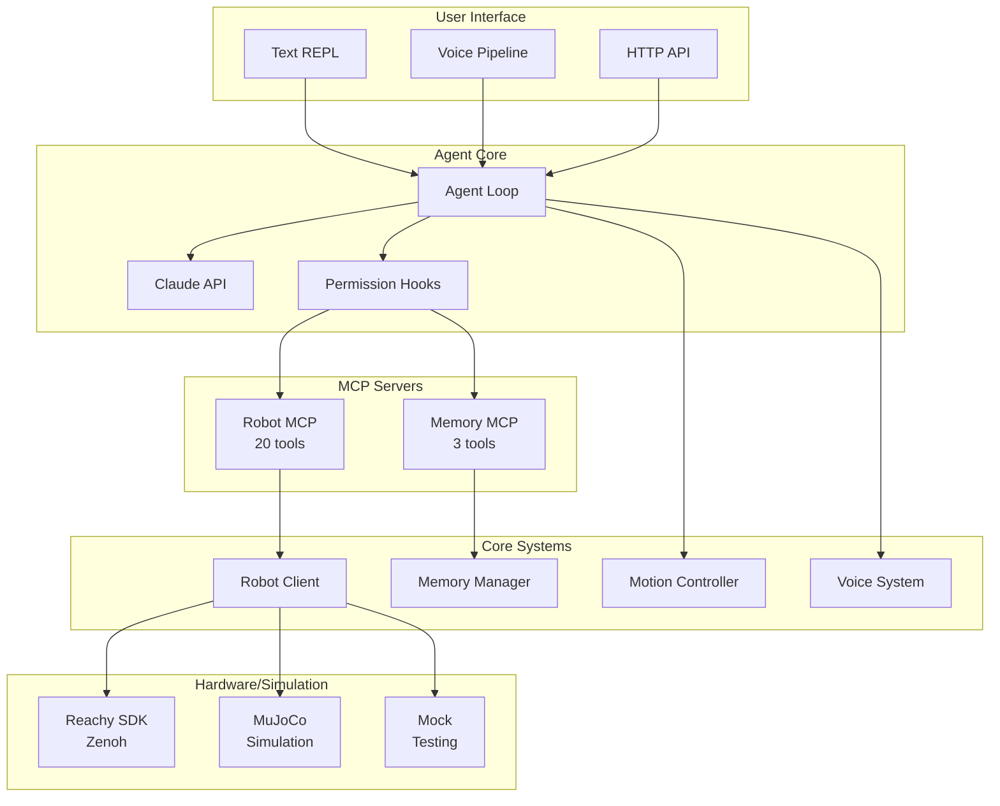

# Developer Guide

Technical documentation for developers working on or extending Claude in the Shell v2.

## Contents

### Architecture

- **[System Architecture](architecture.md)** - High-level design, components, data flow
- **[Voice Pipeline Architecture](voice-pipeline.md)** - Event-driven voice system
- **[Motion System Architecture](motion-system.md)** - 30Hz blend controller
- **[MuJoCo Integration](mujoco-integration.md)** - Physics simulation internals
- **[Permission System](permissions.md)** - Tool authorization design

### Development

- **[Contributing Guide](contributing.md)** - How to contribute to the project

---

## Architecture Overview



---

## Design Principles

### 1. Simplicity Over Flexibility
Fewer options, sensible defaults. Don't expose every knob.

### 2. Event-Driven Over State Machines
Events are easier to debug, extend, and test than explicit state machines.

### 3. Single Backends
One storage system (ChromaDB), one communication layer (Zenoh). No fallbacks.

### 4. Convention Over Configuration
Auto-discover personas from files. Infer wake words from names. Minimize YAML.

### 5. Fail Fast
Clear errors beat silent fallbacks. If SDK is unavailable, crash with message.

---

## Project Structure

```
claude-in-the-shell-v2/
├── config/                 # Configuration files
│   ├── default.yaml        # Default settings
│   └── permissions.yaml    # Tool permission rules
├── prompts/                # System and persona prompts
│   ├── system.md           # Base system prompt
│   └── personas/           # Auto-discovered personas
│       ├── jarvis.md
│       ├── motoko.md
│       └── batou.md
├── src/
│   └── reachy_agent/       # Main source
│       ├── __init__.py
│       ├── __main__.py     # CLI entry point
│       ├── agent/          # Agent core
│       │   ├── loop.py     # Main coordinator
│       │   └── options.py  # Configuration
│       ├── mcp/            # MCP servers
│       │   ├── robot.py    # 20 robot tools
│       │   └── memory.py   # 3 memory tools
│       ├── robot/          # Hardware abstraction
│       │   ├── client.py   # Protocol definition
│       │   ├── sdk.py      # Production client
│       │   ├── mock.py     # Testing client
│       │   └── factory.py  # Client factory
│       ├── voice/          # Voice system
│       │   ├── pipeline.py # Event-driven pipeline
│       │   ├── wake_word.py# Detection
│       │   ├── persona.py  # Persona management
│       │   ├── audio.py    # Audio I/O
│       │   └── realtime.py # OpenAI client
│       ├── motion/         # Motion control
│       │   ├── controller.py # Blend controller
│       │   ├── idle.py     # Idle behavior
│       │   ├── wobble.py   # Speech wobble
│       │   └── emotion.py  # Emotion playback
│       ├── memory/         # Memory system
│       │   └── manager.py  # ChromaDB operations
│       ├── permissions/    # Authorization
│       │   ├── evaluator.py# Rule matching
│       │   └── hooks.py    # SDK hooks
│       ├── simulation/     # MuJoCo simulation
│       │   ├── environment.py
│       │   ├── client.py
│       │   ├── viewer.py
│       │   ├── physics.py
│       │   └── config.py
│       └── utils/          # Utilities
│           ├── config.py   # Configuration loading
│           ├── logging.py  # Structured logging
│           └── events.py   # Event emitter
├── data/                   # Static data
│   ├── emotions/           # Emotion animations
│   ├── models/             # MuJoCo models
│   └── wake_words/         # Wake word models
├── tests/                  # Test suite
│   ├── test_robot.py
│   ├── test_memory.py
│   ├── test_motion.py
│   └── ...
└── docs/                   # Documentation
```

---

## Key Components

### Agent Loop
The main coordinator that ties everything together.
- Processes user input through Claude
- Manages tool execution with permissions
- Integrates voice, motion, and memory

[Read more →](architecture.md#agent-loop)

### Robot Client
Unified interface for robot control.
- Protocol with multiple implementations
- SDK (production), Mock (testing), MuJoCo (simulation)
- Tool result caching

[Read more →](architecture.md#robot-client)

### Voice Pipeline
Event-driven voice interaction.
- Wake word detection with barge-in
- Multi-persona support
- OpenAI Realtime for STT/TTS

[Read more →](voice-pipeline.md)

### Motion Controller
30Hz blend controller for movement.
- PRIMARY sources (idle, emotion)
- OVERLAY sources (wobble)
- Hardware limit clamping

[Read more →](motion-system.md)

### Memory Manager
ChromaDB-backed semantic memory.
- Three memory types with expiry
- Built-in context window
- Vector similarity search

[Read more →](architecture.md#memory-system)

### Permission System
Tool authorization with audit logging.
- Three tiers: AUTONOMOUS, CONFIRM, FORBIDDEN
- Glob pattern matching
- SDK hook integration

[Read more →](permissions.md)

---

## Technology Stack

| Layer | Technology | Why |
|-------|------------|-----|
| AI Model | Claude Haiku 4.5 | Fast, capable |
| Agent SDK | claude-agent-sdk | Official SDK |
| MCP | FastMCP | Simple tool exposure |
| Voice STT/TTS | OpenAI Realtime | Low latency streaming |
| Wake Word | OpenWakeWord | Offline, customizable |
| Memory | ChromaDB | Vector search, simple |
| Embeddings | all-MiniLM-L6-v2 | Small, fast |
| Hardware | Zenoh | 1-5ms latency |
| Simulation | MuJoCo | Physics accurate |
| Config | Pydantic | Type-safe validation |

---

## Development Workflow

### Setup

```bash
# Clone and install
git clone https://github.com/your-repo/claude-in-the-shell-v2.git
cd claude-in-the-shell-v2
uv venv && source .venv/bin/activate
uv pip install -e ".[dev,voice,sim]"
```

### Code Quality

```bash
# Format
uvx black .
uvx isort . --profile black

# Lint
uvx ruff check .

# Type check
uvx mypy .

# All checks
uvx black . && uvx isort . --profile black && uvx ruff check . && uvx mypy .
```

### Testing

```bash
# All tests
pytest -v

# With coverage
pytest --cov=src --cov-report=html

# Specific module
pytest tests/test_motion.py -v

# Watch mode
pytest-watch
```

### Running

```bash
# Mock mode (development)
python -m reachy_agent run --mock

# Simulation mode
python -m reachy_agent run --sim --sim-viewer

# Voice mode
python -m reachy_agent run --mock --voice --debug-voice
```

---

## Navigation

<div class="grid cards" markdown>

-   :material-sitemap: **[Architecture](architecture.md)**

    System design and components

-   :material-microphone: **[Voice Pipeline](voice-pipeline.md)**

    Event-driven voice system

-   :material-robot-industrial: **[Motion System](motion-system.md)**

    30Hz blend controller

-   :material-cube-outline: **[MuJoCo Integration](mujoco-integration.md)**

    Physics simulation

-   :material-shield-lock: **[Permissions](permissions.md)**

    Tool authorization

-   :material-git: **[Contributing](contributing.md)**

    How to contribute

</div>
