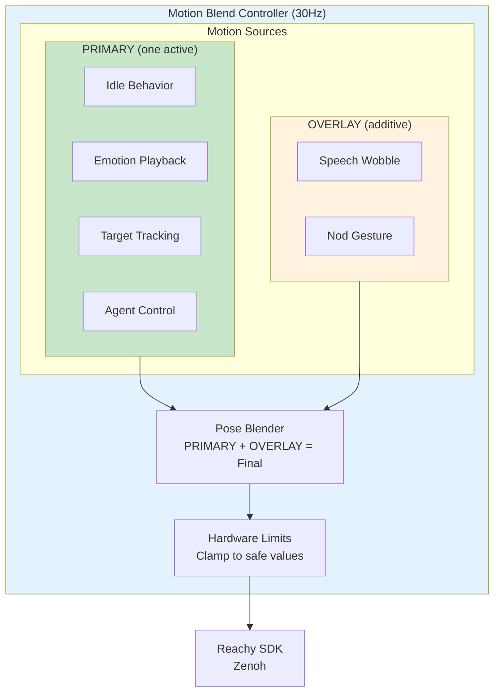
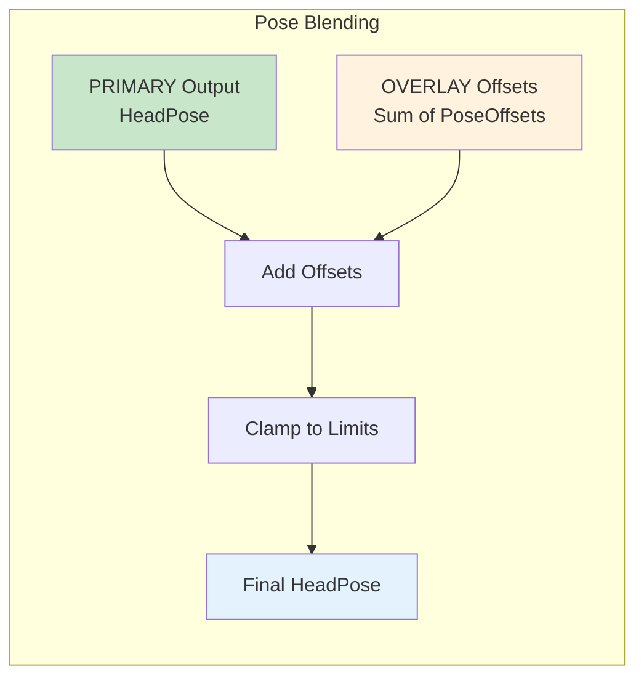
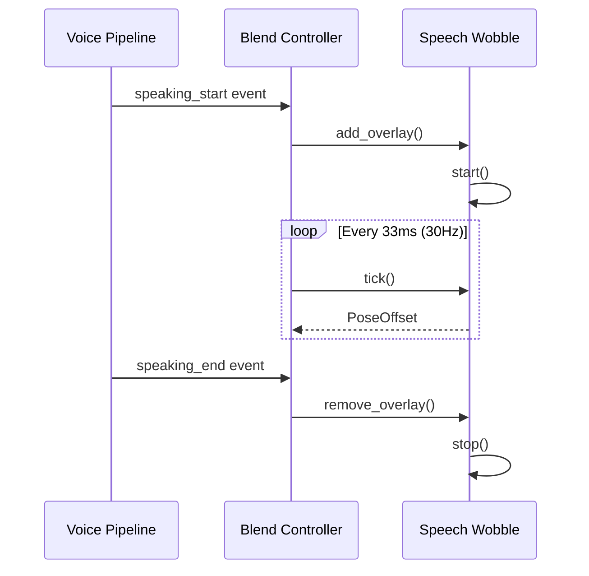

# Motion System Architecture

Deep dive into the 30Hz motion blend controller and motion sources.

## Overview

The motion control system orchestrates robot movement at **30Hz** using a blend controller. Two motion source types compete/combine:

- **PRIMARY** - Idle behavior, emotion playback (mutually exclusive)
- **OVERLAY** - Speech wobble (additive)

No breathing animation - the idle behavior provides the "alive" feeling through Perlin noise.

## Design Principles

| Principle | Description |
|-----------|-------------|
| **SDK-only** | All motion through Reachy SDK (Zenoh). No HTTP fallback |
| **30Hz unified loop** | Single tick rate for all motion sources |
| **Two source types** | PRIMARY (mutually exclusive) and OVERLAY (additive) |
| **No breathing** | Idle behavior handles "alive" feeling |
| **Fail fast** | Connection loss stops motion immediately |

---

## Architecture



---

## Motion Sources

### PRIMARY Sources (Mutually Exclusive)

Only one PRIMARY source active at a time. Setting a new one replaces the current.

| Source | Description | Priority |
|--------|-------------|----------|
| `idle` | Look-around behavior, subtle exploration | Default |
| `emotion` | Playing recorded emotion sequence | Interrupts idle |
| `tracking` | Following a target (face, object) | Interrupts idle |
| `agent` | Direct agent control via MCP tools | Highest |

### OVERLAY Sources (Additive)

OVERLAY sources add to PRIMARY output. Multiple can be active simultaneously.

| Source | Description | Blend Mode |
|--------|-------------|------------|
| `wobble` | Speech animation, audio-reactive | Additive |
| `nod` | Acknowledgment gesture | Additive |

---

## Data Types

### HeadPose

Absolute head position:

```python
@dataclass
class HeadPose:
    """Absolute head position."""
    pitch: float = 0.0  # degrees, -45 to +35
    yaw: float = 0.0    # degrees, -60 to +60
    roll: float = 0.0   # degrees, -35 to +35
    z: float = 0.0      # mm, 0 to 50
```

### PoseOffset

Relative offset added to base pose:

```python
@dataclass
class PoseOffset:
    """Offset to add to base pose."""
    pitch: float = 0.0
    yaw: float = 0.0
    roll: float = 0.0
    z: float = 0.0
```

### AntennaState

Antenna positions:

```python
@dataclass
class AntennaState:
    """Antenna positions."""
    left: float = 0.0   # degrees, -150 to +150
    right: float = 0.0  # degrees, -150 to +150
```

### MotionOutput

Output from a motion source:

```python
class MotionSourceType(Enum):
    PRIMARY = "primary"
    OVERLAY = "overlay"

@dataclass
class MotionOutput:
    """Output from a motion source."""
    head: HeadPose | PoseOffset
    antennas: AntennaState | None = None
    body_angle: float | None = None  # Only PRIMARY can set body
```

---

## Motion Source Protocol

All motion sources implement this interface:

```python
from typing import Protocol

class MotionSource(Protocol):
    """Interface for motion sources."""

    @property
    def name(self) -> str: ...

    @property
    def source_type(self) -> MotionSourceType: ...

    @property
    def is_active(self) -> bool: ...

    async def start(self) -> None: ...

    async def stop(self) -> None: ...

    def tick(self) -> MotionOutput | None:
        """Called at 30Hz. Returns motion output or None if inactive."""
        ...
```

---

## Blend Controller

The central orchestrator running at 30Hz:

```python
class BlendController:
    """Orchestrates motion sources at 30Hz."""

    TICK_HZ = 30
    TICK_INTERVAL = 1.0 / TICK_HZ

    def __init__(self, client: ReachyClient):
        self._client = client
        self._primary: MotionSource | None = None
        self._overlays: dict[str, MotionSource] = {}
        self._running = False
        self._task: asyncio.Task | None = None

    async def start(self):
        """Start the motion control loop."""
        self._running = True
        self._task = asyncio.create_task(self._loop())

        # Start default idle behavior
        await self.set_primary(IdleBehavior())

    async def stop(self):
        """Stop the motion control loop."""
        self._running = False
        if self._task:
            await self._task

    async def set_primary(self, source: MotionSource):
        """Set the PRIMARY motion source."""
        if self._primary:
            await self._primary.stop()
        self._primary = source
        await self._primary.start()

    async def add_overlay(self, source: MotionSource):
        """Add an OVERLAY motion source."""
        self._overlays[source.name] = source
        await source.start()

    async def remove_overlay(self, name: str):
        """Remove an OVERLAY motion source."""
        if name in self._overlays:
            await self._overlays[name].stop()
            del self._overlays[name]
```

### Main Control Loop

```python
async def _loop(self):
    """Main 30Hz control loop."""
    next_tick = time.time()

    while self._running:
        # Get PRIMARY output
        primary_output = None
        if self._primary and self._primary.is_active:
            primary_output = self._primary.tick()

        # Get OVERLAY outputs and sum them
        overlay_offset = PoseOffset()
        for overlay in self._overlays.values():
            if overlay.is_active:
                output = overlay.tick()
                if output and isinstance(output.head, PoseOffset):
                    overlay_offset = self._add_offsets(
                        overlay_offset, output.head
                    )

        # Blend: PRIMARY + OVERLAY
        if primary_output:
            final_pose = self._apply_offset(
                primary_output.head, overlay_offset
            )
            final_pose = self._clamp_pose(final_pose)

            # Send to robot
            await self._client.move_head(
                final_pose, duration=self.TICK_INTERVAL
            )

            if primary_output.antennas:
                await self._client.set_antennas(
                    primary_output.antennas.left,
                    primary_output.antennas.right
                )

        # Maintain tick rate
        next_tick += self.TICK_INTERVAL
        sleep_time = next_tick - time.time()
        if sleep_time > 0:
            await asyncio.sleep(sleep_time)
```

### Blend Algorithm



---

## Idle Behavior

Look-around behavior using **Perlin noise** for organic movement:

```python
import noise

class IdleBehavior:
    """Idle look-around behavior using Perlin noise."""

    def __init__(
        self,
        speed: float = 0.1,        # Movement speed
        amplitude: float = 0.3,    # Movement range (fraction of limits)
        antenna_drift: float = 0.2  # Antenna variation
    ):
        self.name = "idle"
        self.source_type = MotionSourceType.PRIMARY
        self._speed = speed
        self._amplitude = amplitude
        self._antenna_drift = antenna_drift
        self._active = False
        self._time = 0.0
        self._seed = random.random() * 1000

    @property
    def is_active(self) -> bool:
        return self._active

    async def start(self):
        self._active = True
        self._time = 0.0

    async def stop(self):
        self._active = False

    def tick(self) -> MotionOutput | None:
        if not self._active:
            return None

        self._time += 1.0 / 30.0  # 30Hz

        # Perlin noise for organic movement
        t = self._time * self._speed

        # Different noise seeds for each axis
        pitch = noise.pnoise1(t + self._seed) * 35 * self._amplitude
        yaw = noise.pnoise1(t + self._seed + 100) * 60 * self._amplitude
        roll = noise.pnoise1(t + self._seed + 200) * 20 * self._amplitude
        z = (noise.pnoise1(t + self._seed + 300) + 1) * 25 * self._amplitude

        # Antenna drift
        left = noise.pnoise1(t + self._seed + 400) * 30 * self._antenna_drift
        right = noise.pnoise1(t + self._seed + 500) * 30 * self._antenna_drift

        return MotionOutput(
            head=HeadPose(pitch=pitch, yaw=yaw, roll=roll, z=z),
            antennas=AntennaState(left=left, right=right)
        )
```

### Perlin Noise Visualization

```mermaid
graph LR
    subgraph PerlinNoise["Perlin Noise Generation"]
        TIME[Time t] --> NOISE1[noise(t + seed)]
        TIME --> NOISE2[noise(t + seed + 100)]
        TIME --> NOISE3[noise(t + seed + 200)]
        TIME --> NOISE4[noise(t + seed + 300)]

        NOISE1 --> |"× 35 × amp"| PITCH[Pitch]
        NOISE2 --> |"× 60 × amp"| YAW[Yaw]
        NOISE3 --> |"× 20 × amp"| ROLL[Roll]
        NOISE4 --> |"× 25 × amp"| Z[Z Height]
    end

    style PerlinNoise fill:#e8f5e9
```

---

## Speech Wobble (OVERLAY)

Audio-reactive head movement during speech:

```python
class SpeechWobble:
    """Audio-reactive head wobble during speech."""

    def __init__(
        self,
        intensity: float = 1.0,
        frequency: float = 4.0  # Hz
    ):
        self.name = "wobble"
        self.source_type = MotionSourceType.OVERLAY
        self._intensity = intensity
        self._frequency = frequency
        self._active = False
        self._audio_level = 0.0
        self._phase = 0.0

    @property
    def is_active(self) -> bool:
        return self._active

    async def start(self):
        self._active = True
        self._phase = 0.0

    async def stop(self):
        self._active = False

    def set_audio_level(self, level: float):
        """Set current audio level (0-1) for reactivity."""
        self._audio_level = max(0, min(1, level))

    def tick(self) -> MotionOutput | None:
        if not self._active:
            return None

        self._phase += self._frequency / 30.0  # 30Hz
        modulation = self._audio_level * self._intensity

        # Subtle pitch/roll oscillation modulated by audio
        pitch = math.sin(self._phase * 2 * math.pi) * 3 * modulation
        roll = math.cos(self._phase * 2 * math.pi * 1.3) * 2 * modulation

        return MotionOutput(
            head=PoseOffset(pitch=pitch, roll=roll)
        )
```

---

## Emotion Playback

Playing recorded emotion sequences from the library:

```python
class EmotionPlayback:
    """Play recorded emotion from library."""

    def __init__(self, emotion_data: dict):
        self.name = "emotion"
        self.source_type = MotionSourceType.PRIMARY
        self._frames = emotion_data["frames"]
        self._fps = emotion_data.get("fps", 30)
        self._active = False
        self._frame_index = 0

    @property
    def is_active(self) -> bool:
        return self._active and self._frame_index < len(self._frames)

    async def start(self):
        self._active = True
        self._frame_index = 0

    async def stop(self):
        self._active = False

    def tick(self) -> MotionOutput | None:
        if not self.is_active:
            return None

        frame = self._frames[self._frame_index]
        self._frame_index += 1

        return MotionOutput(
            head=HeadPose(
                pitch=frame.get("pitch", 0),
                yaw=frame.get("yaw", 0),
                roll=frame.get("roll", 0),
                z=frame.get("z", 0)
            ),
            antennas=AntennaState(
                left=frame.get("antenna_left", 0),
                right=frame.get("antenna_right", 0)
            )
        )
```

### Emotion Sequences

Support for chaining multiple emotions:

```python
class EmotionSequence:
    """Play sequence of emotions with delays."""

    def __init__(
        self,
        emotions: list[str],
        delays: list[float] | None = None
    ):
        self.name = "emotion_sequence"
        self.source_type = MotionSourceType.PRIMARY
        self._emotions = emotions
        self._delays = delays or [0.5] * len(emotions)
        self._active = False
        self._current_playback: EmotionPlayback | None = None
        self._emotion_index = 0

    @property
    def is_active(self) -> bool:
        return self._active

    async def start(self):
        self._active = True
        self._emotion_index = 0
        await self._start_next_emotion()

    async def _start_next_emotion(self):
        if self._emotion_index >= len(self._emotions):
            self._active = False
            return

        emotion_name = self._emotions[self._emotion_index]
        emotion_data = load_emotion(emotion_name)
        self._current_playback = EmotionPlayback(emotion_data)
        await self._current_playback.start()

    def tick(self) -> MotionOutput | None:
        if not self._active:
            return None

        if self._current_playback and self._current_playback.is_active:
            return self._current_playback.tick()

        # Current emotion finished, start next after delay
        self._emotion_index += 1
        asyncio.create_task(self._delayed_next())
        return None
```

---

## Voice Pipeline Integration

The blend controller integrates with voice events:

```python
# In VoicePipeline setup
@voice.on("speaking_start")
async def handle_speaking(event):
    await blend.add_overlay(SpeechWobble())

@voice.on("speaking_end")
async def handle_speaking_end(event):
    await blend.remove_overlay("wobble")

@voice.on("interrupted")
async def handle_interrupted(event):
    await blend.remove_overlay("wobble")
```



---

## Configuration

```yaml
# config/default.yaml
motion:
  tick_hz: 30
  idle:
    speed: 0.1
    amplitude: 0.3
    antenna_drift: 0.2
  wobble:
    intensity: 1.0
    frequency: 4.0
```

---

## Hardware Limits

The blend controller clamps all output to safe values:

| Joint | Min | Max | Unit |
|-------|-----|-----|------|
| Pitch | -45 | +35 | degrees |
| Yaw | -60 | +60 | degrees |
| Roll | -35 | +35 | degrees |
| Z | 0 | 50 | mm |
| Body Rotation | 0 | 360 | degrees |
| Antennas | -150 | +150 | degrees |

```python
def _clamp_pose(self, pose: HeadPose) -> HeadPose:
    """Clamp pose to hardware limits."""
    return HeadPose(
        pitch=max(-45, min(35, pose.pitch)),
        yaw=max(-60, min(60, pose.yaw)),
        roll=max(-35, min(35, pose.roll)),
        z=max(0, min(50, pose.z))
    )
```

---

## What Changed from v1

| Aspect | v1 | v2 |
|--------|----|----|
| Motion sources | 4 (breathing, idle, wobble, emotions) | 2 types (PRIMARY, OVERLAY) |
| Breathing | Separate behavior | Removed (idle is sufficient) |
| Tick rates | Separate tick/command rates | Unified 30Hz |
| Communication | SDK + HTTP fallback | SDK only |
| Source types | All equal priority | PRIMARY vs OVERLAY |

### Why No Breathing?

v1 had a separate `BreathingMotion` class that added subtle Z-axis oscillation. However:

1. **Competing with idle** - Both trying to make robot look "alive"
2. **Complexity** - Two PRIMARY sources needed arbitration logic
3. **Subtlety** - Breathing was so subtle it was barely noticeable
4. **Idle does it better** - Perlin noise already creates organic movement

The idle behavior now incorporates subtle Z-axis variation through its noise function, achieving the same effect with simpler code.

---

## Related Documentation

- [Robot Movements User Guide](../user-guide/robot-movements.md) - User-focused movement docs
- [Motion Control API](../api-reference/motion-control.md) - API reference
- [Emotion Expressions Tutorial](../tutorials/emotion-expressions.md) - Creating emotions
