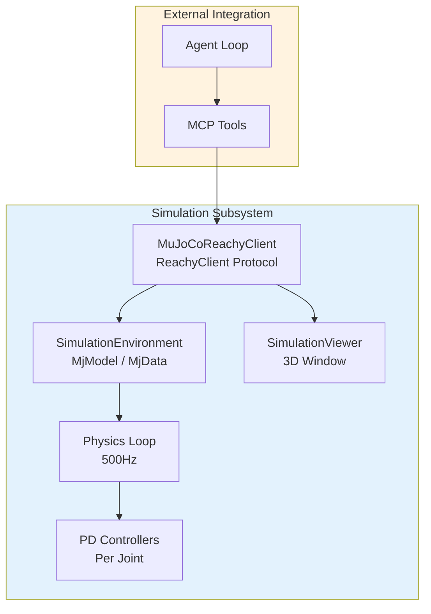
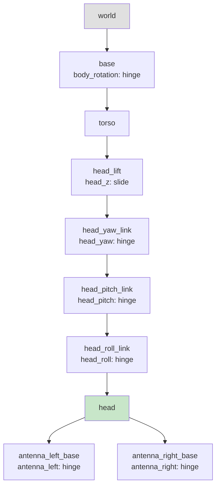
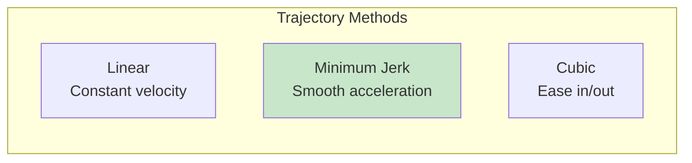
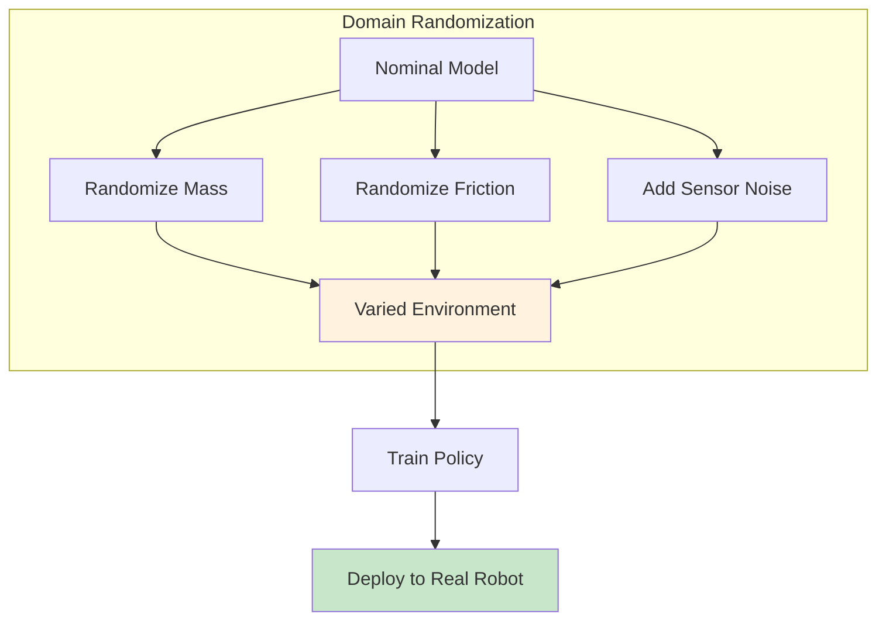

# MuJoCo Simulation Integration

Deep dive into the physics simulation subsystem for development without hardware.

## Overview

The MuJoCo simulation subsystem provides **physics-accurate simulation** of the Reachy Mini robot, enabling development and testing without physical hardware. It uses the MuJoCo physics engine for realistic dynamics and supports both real-time interactive use and fast-forward batch simulation.

## Architecture



---

## MJCF Model Structure

### Kinematic Chain



### Joint Configuration

| Joint | Type | Limits | Default | Axis |
|-------|------|--------|---------|------|
| body_rotation | hinge | -180° to +180° | 0° | Z |
| head_z | slide | 0mm to 50mm | 0mm | Z |
| head_yaw | hinge | -60° to +60° | 0° | Z |
| head_pitch | hinge | -45° to +35° | 0° | Y |
| head_roll | hinge | -35° to +35° | 0° | X |
| antenna_left | hinge | -150° to +150° | 0° | Y |
| antenna_right | hinge | -150° to +150° | 0° | Y |

### Actuators

Each joint has a position-controlled actuator with PD gains:

| Actuator | Joint | Kp | Kv | Control Range |
|----------|-------|----|----|---------------|
| body_rotation_actuator | body_rotation | 200 | 20 | -180° to +180° |
| head_z_actuator | head_z | 500 | 50 | 0mm to 50mm |
| head_yaw_actuator | head_yaw | 100 | 10 | -60° to +60° |
| head_pitch_actuator | head_pitch | 100 | 10 | -45° to +35° |
| head_roll_actuator | head_roll | 100 | 10 | -35° to +35° |
| antenna_left_actuator | antenna_left | 50 | 5 | -150° to +150° |
| antenna_right_actuator | antenna_right | 50 | 5 | -150° to +150° |

### Sensors

| Sensor | Type | Description |
|--------|------|-------------|
| *_pos | jointpos | Position for each joint |
| *_vel | jointvel | Velocity for each joint |
| head_accel | accelerometer | 3-axis accelerometer on head |
| head_gyro | gyro | 3-axis gyroscope on head |
| head_camera | camera | RGB camera (90° FOV) |

---

## Components

### MuJoCoReachyClient

Implements the `ReachyClient` protocol using MuJoCo simulation:

```python
from reachy_agent.simulation import MuJoCoReachyClient

class MuJoCoReachyClient:
    """Simulation client using MuJoCo physics."""

    def __init__(
        self,
        model_path: str = "data/models/reachy_mini/reachy_mini.xml",
        realtime: bool = True,
        viewer: bool = False
    ):
        """
        Create simulation client.

        Args:
            model_path: Path to MJCF model file
            realtime: Match wall clock time
            viewer: Enable 3D visualization
        """
        self._model_path = model_path
        self._realtime = realtime
        self._viewer = viewer
        self._env: SimulationEnvironment | None = None

    async def connect(self) -> None:
        """Initialize simulation environment."""
        self._env = SimulationEnvironment(
            model_path=self._model_path,
            realtime=self._realtime,
            viewer=self._viewer
        )
        await self._env.start()

    async def move_head(
        self,
        pitch: float = 0.0,
        yaw: float = 0.0,
        roll: float = 0.0,
        duration: float = 1.0
    ) -> None:
        """Move head in simulation."""
        await self._env.move_joints(
            {
                "head_pitch": pitch,
                "head_yaw": yaw,
                "head_roll": roll
            },
            duration=duration
        )
```

**Usage:**

```python
client = MuJoCoReachyClient(realtime=True, viewer=True)
await client.connect()
await client.wake_up()
await client.move_head(pitch=15, yaw=20, duration=1.0)
# 3D viewer shows movement with physics
await client.disconnect()
```

### SimulationEnvironment

Low-level wrapper around MuJoCo model and data:

```python
from reachy_agent.simulation.environment import SimulationEnvironment

class SimulationEnvironment:
    """Low-level MuJoCo environment wrapper."""

    def __init__(
        self,
        model_path: str,
        timestep: float = 0.002,
        realtime: bool = True,
        viewer: bool = False
    ):
        self._model_path = model_path
        self._timestep = timestep
        self._realtime = realtime
        self._viewer_enabled = viewer
        self._model: mujoco.MjModel | None = None
        self._data: mujoco.MjData | None = None

    async def start(self):
        """Start simulation."""
        self._model = mujoco.MjModel.from_xml_path(self._model_path)
        self._data = mujoco.MjData(self._model)

        if self._viewer_enabled:
            self._viewer = SimulationViewer(self._model, self._data)
            self._viewer.start()

    async def move_joints(
        self,
        targets: dict[str, float],
        duration: float
    ) -> None:
        """Move joints to target positions."""
        start_time = self._data.time
        start_positions = self._get_joint_positions()

        while self._data.time - start_time < duration:
            t = (self._data.time - start_time) / duration
            t = min(1.0, t)

            # Interpolate positions
            for joint, target in targets.items():
                start = start_positions[joint]
                current = self._interpolate(start, target, t)
                self._set_control(joint, current)

            # Step simulation
            mujoco.mj_step(self._model, self._data)

            if self._realtime:
                await asyncio.sleep(self._timestep)

    async def get_joint_positions(self) -> dict[str, float]:
        """Get current joint positions."""
        return {
            "head_pitch": self._data.qpos[self._pitch_idx],
            "head_yaw": self._data.qpos[self._yaw_idx],
            "head_roll": self._data.qpos[self._roll_idx],
            "head_z": self._data.qpos[self._z_idx],
            "body_rotation": self._data.qpos[self._body_idx],
            "antenna_left": self._data.qpos[self._antenna_l_idx],
            "antenna_right": self._data.qpos[self._antenna_r_idx],
        }
```

### SimulationViewer

Real-time 3D visualization with camera controls:

```python
from reachy_agent.simulation.viewer import SimulationViewer

class SimulationViewer:
    """3D visualization using MuJoCo viewer."""

    def __init__(self, model: mujoco.MjModel, data: mujoco.MjData):
        self._model = model
        self._data = data
        self._viewer: mujoco.viewer.Handle | None = None
        self._recording = False
        self._frames: list[np.ndarray] = []

    def start(self):
        """Start the viewer window."""
        self._viewer = mujoco.viewer.launch_passive(
            self._model, self._data
        )

    def stop(self):
        """Close the viewer window."""
        if self._viewer:
            self._viewer.close()

    def set_camera_preset(self, preset: str):
        """Set camera to predefined position."""
        presets = {
            "front": {"azimuth": 0, "elevation": -20, "distance": 1.5},
            "side": {"azimuth": 90, "elevation": -15, "distance": 1.5},
            "top": {"azimuth": 0, "elevation": -90, "distance": 2.0},
        }
        if preset in presets:
            self._viewer.cam.azimuth = presets[preset]["azimuth"]
            self._viewer.cam.elevation = presets[preset]["elevation"]
            self._viewer.cam.distance = presets[preset]["distance"]

    def start_recording(self):
        """Start recording frames."""
        self._recording = True
        self._frames = []

    def stop_recording(self) -> list[np.ndarray]:
        """Stop recording and return frames."""
        self._recording = False
        return self._frames

    def save_video(
        self,
        path: str,
        fps: int = 30,
        frames: list[np.ndarray] | None = None
    ):
        """Save recorded frames as video."""
        frames = frames or self._frames
        import imageio
        imageio.mimwrite(path, frames, fps=fps)
```

---

## Physics Controllers

### PD Controller

Position-derivative controllers for smooth joint motion:

```python
from reachy_agent.simulation.physics import PDController

class PDController:
    """Proportional-Derivative controller."""

    def __init__(
        self,
        kp: float = 100.0,
        kd: float = 10.0,
        max_torque: float = 50.0
    ):
        self._kp = kp
        self._kd = kd
        self._max_torque = max_torque

    def compute(
        self,
        target: float,
        current: float,
        velocity: float
    ) -> float:
        """Compute control torque."""
        error = target - current
        torque = self._kp * error - self._kd * velocity
        return max(-self._max_torque, min(self._max_torque, torque))
```

### Trajectory Interpolation

Smooth motion profiles:

```python
from reachy_agent.simulation.physics import TrajectoryInterpolator

class TrajectoryInterpolator:
    """Smooth trajectory generation."""

    def __init__(self, method: str = "minimum_jerk"):
        self._method = method

    def interpolate(
        self,
        start: float,
        end: float,
        t: float,
        duration: float
    ) -> float:
        """Interpolate position at time t."""
        if self._method == "linear":
            return start + (end - start) * t

        elif self._method == "minimum_jerk":
            # Minimum jerk trajectory (smooth acceleration)
            s = t / duration
            s = 10 * s**3 - 15 * s**4 + 6 * s**5
            return start + (end - start) * s

        elif self._method == "cubic":
            # Cubic ease in/out
            s = t / duration
            if s < 0.5:
                s = 4 * s**3
            else:
                s = 1 - (-2 * s + 2)**3 / 2
            return start + (end - start) * s
```



---

## Configuration

### config/default.yaml

```yaml
simulation:
  model_path: data/models/reachy_mini/reachy_mini.xml
  timestep: 0.002  # 500Hz physics
  n_substeps: 4
  realtime: true
  viewer: false
  headless: false
  render:
    width: 640
    height: 480
    quality: medium
    shadows: true
    antialiasing: true
  physics:
    gravity: [0, 0, -9.81]
    friction: 0.8
    damping: 1.0
  recording:
    fps: 30
    format: mp4
```

---

## CLI Usage

```bash
# Run with simulation backend
python -m reachy_agent run --sim

# Run with simulation and viewer
python -m reachy_agent run --sim --sim-viewer

# Run fast-forward (non-realtime) simulation
python -m reachy_agent run --sim --no-sim-realtime

# Check simulation availability
python -m reachy_agent check
```

---

## Advanced Features

### Domain Randomization

For robust sim-to-real transfer:

```python
from reachy_agent.simulation.config import DomainRandomizationConfig

dr_config = DomainRandomizationConfig(
    enabled=True,
    mass_range=(0.8, 1.2),      # Scale mass by 80-120%
    friction_range=(0.5, 1.2),  # Vary friction
    noise_std=0.01,             # Sensor noise
)
```



### Parallel Simulation

For batch processing and RL training:

```python
from reachy_agent.simulation import ParallelSimulation

parallel = ParallelSimulation(n_envs=8)
observations = parallel.reset()

for _ in range(1000):
    actions = policy(observations)
    observations, rewards, dones = parallel.step(actions)
```

### Gymnasium Environment

For reinforcement learning:

```python
from reachy_agent.simulation import ReachyGymEnv

env = ReachyGymEnv()
obs, info = env.reset()

for _ in range(1000):
    action = env.action_space.sample()
    obs, reward, terminated, truncated, info = env.step(action)
```

---

## Performance Considerations

| Aspect | Value | Notes |
|--------|-------|-------|
| Physics rate | 500Hz | 2ms timestep with 4 substeps |
| Effective step | 0.5ms | After substeps |
| Real-time mode | ~1x speed | Matches wall clock |
| Fast-forward | 10-50x speed | As fast as CPU allows |
| Viewer overhead | ~1ms/frame | Negligible |
| Headless rendering | EGL/OSMesa | No display required |

---

## Testing

```bash
# Run simulation tests
uv run pytest tests/test_simulation.py -v

# Run with MuJoCo if available
uv run pytest tests/test_simulation.py -v --ignore-mujoco-skip

# Run performance benchmarks
uv run pytest tests/test_simulation.py::TestSimulationPerformance -v
```

---

## Dependencies

Install simulation dependencies:

```bash
uv pip install -e '.[sim]'
```

Required packages:

| Package | Version | Purpose |
|---------|---------|---------|
| mujoco | >= 3.0.0 | Physics engine |
| dm_control | >= 1.0.0 | Control suite utilities |
| imageio | >= 2.31.0 | Video recording |
| imageio-ffmpeg | >= 0.4.8 | FFmpeg backend |
| glfw | >= 2.6.0 | Window management |
| gymnasium | >= 0.29.0 | RL environment API |

---

## Model Files

The MJCF model is located at:

```
data/models/reachy_mini/
├── reachy_mini.xml      # Main model file
├── meshes/              # Visual meshes
│   ├── head.stl
│   ├── torso.stl
│   └── antenna.stl
└── textures/            # Surface textures
    └── robot_skin.png
```

---

## Related Documentation

- [Simulation User Guide](../user-guide/simulation.md) - User-focused simulation docs
- [MuJoCo Setup Tutorial](../tutorials/mujoco-setup.md) - Step-by-step setup
- [Architecture Overview](architecture.md) - System-level design
