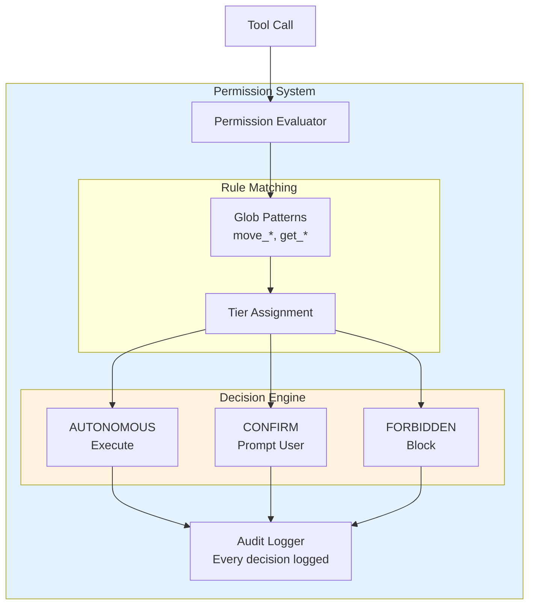
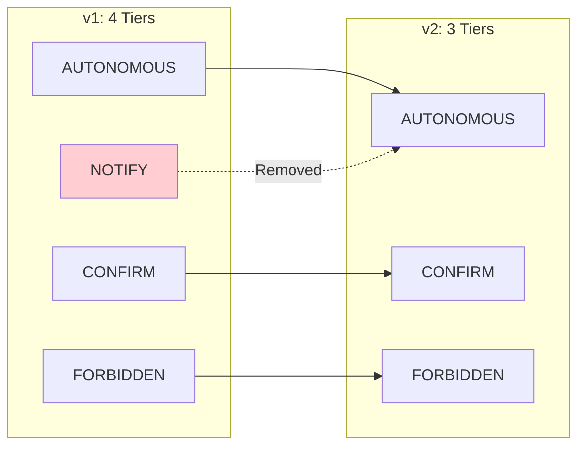
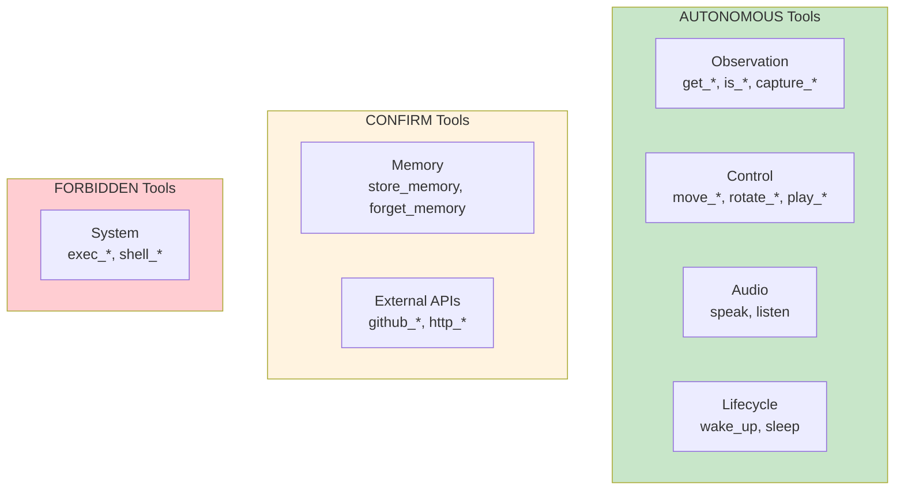
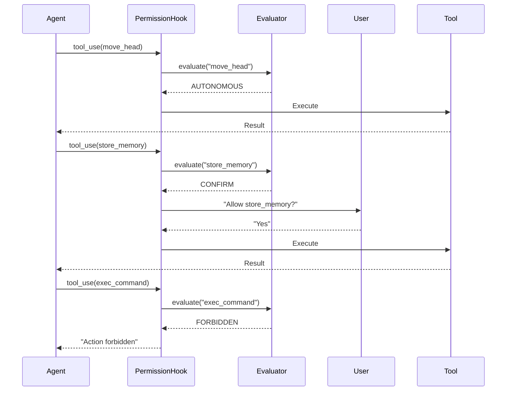

# Permission System

Deep dive into the 3-tier tool authorization system.

## Overview

The permission system controls which MCP tools Claude can execute and how. Three tiers provide a simple mental model:

| Tier | Behavior | Examples |
|------|----------|----------|
| **AUTONOMOUS** | Execute immediately, no user interaction | `get_status`, `move_head`, `speak` |
| **CONFIRM** | Pause, ask user, wait for approval | `store_memory`, external APIs |
| **FORBIDDEN** | Never execute, return error | System commands |

## Design Principles

| Principle | Description |
|-----------|-------------|
| **Three tiers only** | AUTONOMOUS, CONFIRM, FORBIDDEN. Simple mental model |
| **No NOTIFY** | If safe to execute, execute. Don't interrupt for notifications |
| **Glob patterns** | Flexible matching for tool names |
| **Audit logging** | Every tool call logged with permission decision |
| **Fail closed** | Unknown tools default to CONFIRM, not AUTONOMOUS |

---

## Architecture



---

## Why No NOTIFY?

v1 had a NOTIFY tier that executed tools but showed a notification. Problems:

1. **Confusing UX** - User sees notification after action is done. What are they supposed to do?
2. **False sense of control** - Can't undo, so notification is just noise
3. **Complexity** - Another code path to maintain and test

**Solution**: If an action is reversible and safe, make it AUTONOMOUS. If it needs oversight, make it CONFIRM. There's no middle ground that provides value.



---

## Data Types

```python
from dataclasses import dataclass
from enum import Enum
from typing import Any

class PermissionTier(Enum):
    AUTONOMOUS = "autonomous"  # Execute freely
    CONFIRM = "confirm"        # Require user approval
    FORBIDDEN = "forbidden"    # Never execute

@dataclass
class PermissionRule:
    """A rule mapping tool patterns to permission tiers."""
    pattern: str           # Glob pattern, e.g., "move_*", "get_*"
    tier: PermissionTier
    reason: str | None = None  # Optional explanation

@dataclass
class PermissionDecision:
    """Result of evaluating a tool call."""
    tool_name: str
    tier: PermissionTier
    matched_rule: str | None  # Which pattern matched
    allowed: bool
    reason: str | None

@dataclass
class AuditEntry:
    """Logged permission decision."""
    timestamp: str
    tool_name: str
    tool_args: dict[str, Any]
    tier: PermissionTier
    allowed: bool
    user_response: str | None  # For CONFIRM: "approved" | "denied"
```

---

## Default Rules

```yaml
# config/permissions.yaml
rules:
  # Robot observation - always allowed
  - pattern: "get_*"
    tier: autonomous

  - pattern: "is_*"
    tier: autonomous

  - pattern: "capture_image"
    tier: autonomous

  - pattern: "detect_*"
    tier: autonomous

  # Robot control - allowed (reversible)
  - pattern: "move_*"
    tier: autonomous

  - pattern: "look_at"
    tier: autonomous

  - pattern: "rotate_*"
    tier: autonomous

  - pattern: "play_*"
    tier: autonomous

  - pattern: "set_antennas"
    tier: autonomous

  - pattern: "nod"
    tier: autonomous

  - pattern: "shake"
    tier: autonomous

  # Audio - allowed
  - pattern: "speak"
    tier: autonomous

  - pattern: "listen"
    tier: autonomous

  # Lifecycle - allowed
  - pattern: "wake_up"
    tier: autonomous

  - pattern: "sleep"
    tier: autonomous

  # Memory - context allowed, permanent needs confirmation
  - pattern: "search_memories"
    tier: autonomous

  - pattern: "store_memory"
    tier: confirm
    reason: "Storing permanent memories requires approval"

  - pattern: "forget_memory"
    tier: confirm
    reason: "Deleting memories requires approval"

  # External APIs - need confirmation
  - pattern: "github_*"
    tier: confirm
    reason: "External API actions require approval"

  # System-level - forbidden
  - pattern: "exec_*"
    tier: forbidden
    reason: "System command execution is not allowed"

  - pattern: "shell_*"
    tier: forbidden

# Default for unmatched tools
default_tier: confirm
```

### Rule Categories



---

## Permission Evaluator

```python
import fnmatch
import structlog
from datetime import datetime

class PermissionEvaluator:
    """Evaluates and enforces tool permissions."""

    def __init__(
        self,
        rules: list[PermissionRule],
        default_tier: PermissionTier = PermissionTier.CONFIRM
    ):
        self._rules = rules
        self._default = default_tier
        self._log = structlog.get_logger()

    def evaluate(
        self,
        tool_name: str,
        tool_args: dict | None = None
    ) -> PermissionDecision:
        """Evaluate permission for a tool call."""
        # Find matching rule
        matched_rule = None
        tier = self._default

        for rule in self._rules:
            if fnmatch.fnmatch(tool_name, rule.pattern):
                matched_rule = rule.pattern
                tier = rule.tier
                break

        # Build decision
        allowed = tier != PermissionTier.FORBIDDEN

        decision = PermissionDecision(
            tool_name=tool_name,
            tier=tier,
            matched_rule=matched_rule,
            allowed=allowed,
            reason=self._get_reason(tier, matched_rule)
        )

        # Log decision
        self._log.info(
            "permission_evaluated",
            tool=tool_name,
            tier=tier.value,
            allowed=allowed,
            matched=matched_rule
        )

        return decision

    def _get_reason(
        self,
        tier: PermissionTier,
        matched_rule: str | None
    ) -> str | None:
        """Get human-readable reason for decision."""
        if matched_rule:
            for rule in self._rules:
                if rule.pattern == matched_rule:
                    return rule.reason

        match tier:
            case PermissionTier.FORBIDDEN:
                return "This action is not permitted"
            case PermissionTier.CONFIRM:
                return "This action requires user approval"
            case _:
                return None
```

---

## Agent SDK Integration

Using Claude Agent SDK hooks to intercept tool calls:

```python
from anthropic.types import ToolUseBlock
from claude_agent_sdk import Agent, PreToolUseHook, PreToolUseResult

class PermissionHook(PreToolUseHook):
    """Hook that enforces permissions before tool execution."""

    def __init__(
        self,
        evaluator: PermissionEvaluator,
        confirm_callback
    ):
        self._evaluator = evaluator
        self._confirm = confirm_callback  # Function to ask user

    async def __call__(
        self,
        tool_use: ToolUseBlock,
        agent: Agent
    ) -> PreToolUseResult:
        """Called before each tool execution."""
        decision = self._evaluator.evaluate(
            tool_use.name,
            tool_use.input
        )

        match decision.tier:
            case PermissionTier.AUTONOMOUS:
                # Execute freely
                return PreToolUseResult(allow=True)

            case PermissionTier.CONFIRM:
                # Ask user
                approved = await self._confirm(
                    tool_name=tool_use.name,
                    tool_args=tool_use.input,
                    reason=decision.reason
                )
                return PreToolUseResult(
                    allow=approved,
                    message=None if approved else "User denied permission"
                )

            case PermissionTier.FORBIDDEN:
                # Block
                return PreToolUseResult(
                    allow=False,
                    message=f"Action forbidden: {decision.reason}"
                )
```



---

## Confirmation UI

### Text Mode

```python
async def confirm_tool_use(
    tool_name: str,
    tool_args: dict,
    reason: str | None
) -> bool:
    """Ask user to approve tool execution."""
    print(f"\n Permission Required")
    print(f"   Tool: {tool_name}")
    print(f"   Args: {json.dumps(tool_args, indent=2)}")
    if reason:
        print(f"   Reason: {reason}")

    response = input("   Allow? [y/N]: ").strip().lower()
    return response in ("y", "yes")
```

### Voice Mode

```python
async def confirm_tool_use_voice(
    tool_name: str,
    tool_args: dict,
    reason: str | None
) -> bool:
    """Ask user verbally to approve tool execution."""
    await speak(f"I'd like to {tool_name}. Is that okay?")
    response = await listen(timeout=10)

    approved = any(
        word in response.lower()
        for word in ["yes", "okay", "sure", "go ahead"]
    )
    return approved
```

---

## Audit Logging

Every permission decision is logged for review:

```python
class AuditLogger:
    """Logs all permission decisions for review."""

    def __init__(self, log_path: str = "~/.reachy/audit.jsonl"):
        self._path = Path(log_path).expanduser()
        self._path.parent.mkdir(parents=True, exist_ok=True)

    def log(
        self,
        decision: PermissionDecision,
        tool_args: dict,
        user_response: str | None = None
    ):
        """Log a permission decision."""
        entry = {
            "timestamp": datetime.utcnow().isoformat(),
            "tool_name": decision.tool_name,
            "tool_args": tool_args,
            "tier": decision.tier.value,
            "allowed": decision.allowed,
            "matched_rule": decision.matched_rule,
            "user_response": user_response
        }

        with open(self._path, "a") as f:
            f.write(json.dumps(entry) + "\n")
```

### Example Audit Log

```json
{"timestamp": "2025-01-05T10:30:00Z", "tool_name": "move_head", "tool_args": {"pitch": 10}, "tier": "autonomous", "allowed": true, "matched_rule": "move_*", "user_response": null}
{"timestamp": "2025-01-05T10:30:15Z", "tool_name": "store_memory", "tool_args": {"content": "User likes jazz"}, "tier": "confirm", "allowed": true, "matched_rule": "store_memory", "user_response": "approved"}
{"timestamp": "2025-01-05T10:30:30Z", "tool_name": "exec_command", "tool_args": {"cmd": "rm -rf /"}, "tier": "forbidden", "allowed": false, "matched_rule": "exec_*", "user_response": null}
```

---

## Configuration

```yaml
# config/permissions.yaml
rules:
  # ... (see default rules above)

default_tier: confirm

audit:
  enabled: true
  path: ~/.reachy/audit.jsonl
  retention_days: 30
```

### Loading Configuration

```python
def load_permissions(
    config_path: str = "config/permissions.yaml"
) -> PermissionEvaluator:
    """Load permission rules from config."""
    with open(config_path) as f:
        config = yaml.safe_load(f)

    rules = [
        PermissionRule(
            pattern=r["pattern"],
            tier=PermissionTier(r["tier"]),
            reason=r.get("reason")
        )
        for r in config.get("rules", [])
    ]

    default = PermissionTier(config.get("default_tier", "confirm"))

    return PermissionEvaluator(rules, default)
```

---

## Security Considerations

| Consideration | Implementation |
|---------------|----------------|
| **Fail closed** | Unknown tools require confirmation by default |
| **No shell access** | `exec_*`, `shell_*` are FORBIDDEN |
| **External APIs gated** | GitHub, HTTP, etc. require CONFIRM |
| **Audit trail** | Every decision logged |
| **Pattern ordering** | More specific patterns should come first |

---

## What Changed from v1

| Aspect | v1 | v2 |
|--------|----|----|
| Tiers | 4 (AUTONOMOUS, NOTIFY, CONFIRM, FORBIDDEN) | 3 (removed NOTIFY) |
| Default tier | NOTIFY | CONFIRM (safer) |
| NOTIFY behavior | Execute + show notification | Removed |
| Code paths | 4 | 3 |

---

## Customizing Permissions

### Adding Custom Rules

Edit `config/permissions.yaml`:

```yaml
rules:
  # Your custom rules
  - pattern: "my_custom_tool"
    tier: autonomous
    reason: "Safe for automatic execution"

  - pattern: "dangerous_*"
    tier: confirm
    reason: "Requires user approval for safety"

  # Default rules follow...
```

### Programmatic Configuration

```python
from reachy_agent.permissions import PermissionRule, PermissionTier

# Add rules programmatically
evaluator.add_rule(PermissionRule(
    pattern="my_tool_*",
    tier=PermissionTier.AUTONOMOUS,
    reason="Custom tool is safe"
))
```

---

## Related Documentation

- [Robot Tools API](../api-reference/robot-tools.md) - Tools that permissions apply to
- [Memory Tools API](../api-reference/memory-tools.md) - Memory tools with CONFIRM tier
- [Architecture Overview](architecture.md) - System-level design
