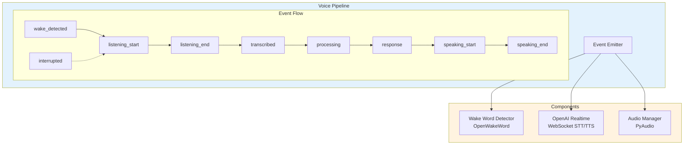
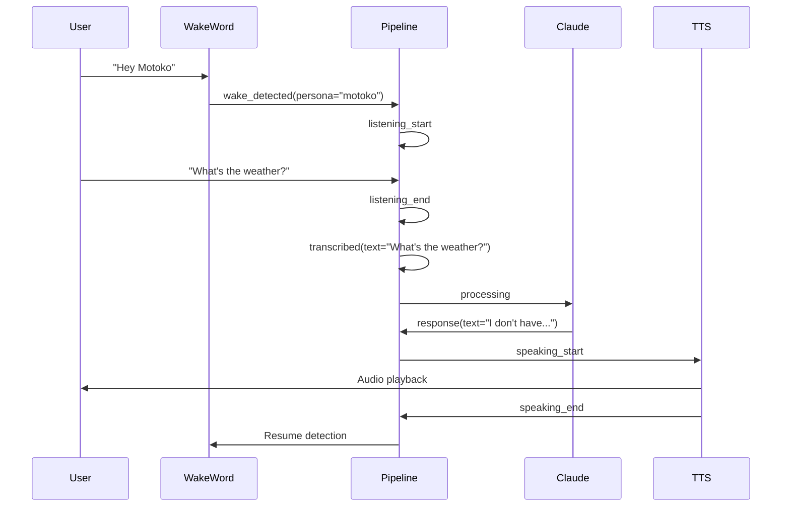
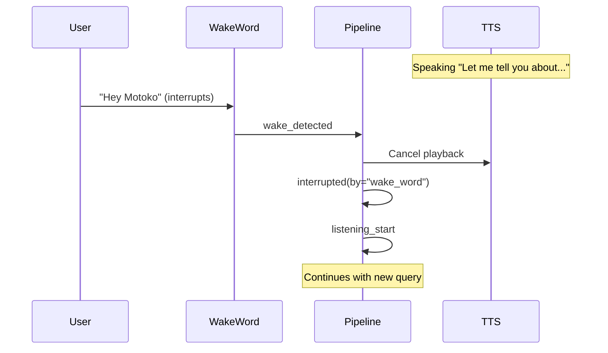
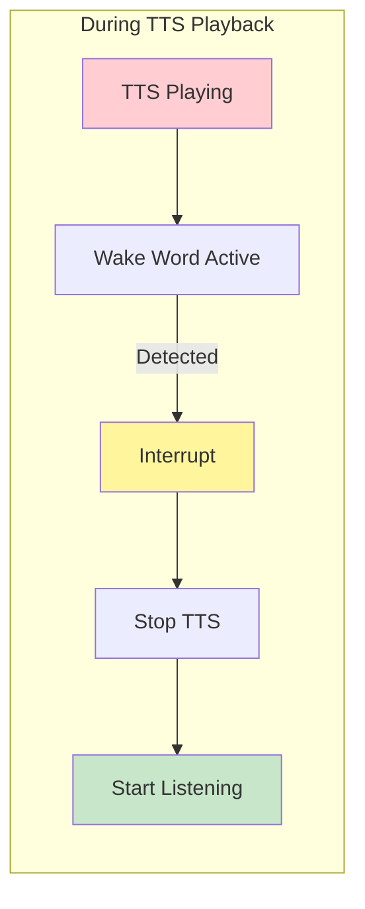

# Voice Pipeline Architecture

Deep dive into the event-driven voice interaction system.

## Overview

The voice pipeline enables natural voice conversations with **barge-in support**. Instead of a rigid state machine, it uses an event-driven architecture where each event triggers handlers that do one thing well.

## Design Principles

| Principle | Description |
|-----------|-------------|
| **Event-driven** | No explicit state machine. State is implicit in which handlers are active |
| **Barge-in support** | Wake word detection runs during TTS. Users can interrupt |
| **Debug-friendly** | Every event logged with timestamp. `--debug-voice` shows full trace |
| **Persona auto-discovery** | Personas discovered from `prompts/personas/*.md` |

---

## Architecture



---

## Event Reference

### Event Types

| Event | Payload | Description |
|-------|---------|-------------|
| `wake_detected` | `{persona: str, confidence: float}` | Wake word triggered |
| `listening_start` | `{persona: str}` | Started capturing audio |
| `listening_end` | `{audio_duration: float}` | Stopped capturing (silence detected) |
| `transcribed` | `{text: str, confidence: float}` | Speech-to-text complete |
| `processing` | `{text: str}` | Sending to Claude |
| `response` | `{text: str}` | Claude response received |
| `speaking_start` | `{text: str, voice: str}` | TTS playback starting |
| `speaking_end` | `{}` | TTS playback complete |
| `interrupted` | `{by: str}` | TTS interrupted (wake word or error) |
| `error` | `{type: str, message: str}` | Error occurred |
| `timeout` | `{phase: str}` | Timeout during phase |

### Normal Conversation Flow



### Barge-in (Interrupt) Flow



---

## Core Components

### Event Emitter

The foundation of the event-driven architecture:

```python
from dataclasses import dataclass, field
from typing import Callable, Any
from collections import defaultdict
import asyncio
import structlog

@dataclass
class Event:
    name: str
    data: dict[str, Any] = field(default_factory=dict)
    timestamp: float = field(default_factory=lambda: time.time())

class EventEmitter:
    def __init__(self, debug: bool = False):
        self._handlers: dict[str, list[Callable]] = defaultdict(list)
        self._debug = debug
        self._log = structlog.get_logger()

    def on(self, event_name: str):
        """Decorator to register event handler."""
        def decorator(fn: Callable):
            self._handlers[event_name].append(fn)
            return fn
        return decorator

    async def emit(self, event_name: str, **data):
        """Emit event to all registered handlers."""
        event = Event(name=event_name, data=data)

        if self._debug:
            self._log.debug("voice_event", event=event_name, **data)

        for handler in self._handlers[event_name]:
            try:
                result = handler(event)
                if asyncio.iscoroutine(result):
                    await result
            except Exception as e:
                await self.emit("error", type=type(e).__name__, message=str(e))
```

### Voice Pipeline

Main coordinator that registers event handlers:

```python
class VoicePipeline(EventEmitter):
    """Event-driven voice interaction pipeline."""

    def __init__(
        self,
        agent: "ReachyAgentLoop",
        persona_manager: "PersonaManager",
        debug: bool = False
    ):
        super().__init__(debug=debug)
        self._agent = agent
        self._personas = persona_manager
        self._wake_detector: WakeWordDetector | None = None
        self._realtime: OpenAIRealtimeClient | None = None
        self._audio: AudioManager | None = None
        self._current_persona: str | None = None
        self._is_speaking = False

        self._register_handlers()

    def _register_handlers(self):
        """Register all event handlers."""

        @self.on("wake_detected")
        async def handle_wake(event: Event):
            persona = event.data["persona"]
            self._current_persona = persona
            await self._personas.switch_to(persona)
            await self.emit("listening_start", persona=persona)

        @self.on("listening_start")
        async def handle_listening_start(event: Event):
            self._audio.start_capture()
            await self._realtime.start_session(
                voice=self._personas.get_voice(self._current_persona)
            )

        @self.on("transcribed")
        async def handle_transcribed(event: Event):
            text = event.data["text"]
            await self.emit("processing", text=text)
            response = await self._agent.process(text)
            await self.emit("response", text=response)

        @self.on("speaking_start")
        async def handle_speaking_start(event: Event):
            self._is_speaking = True
            self._wake_detector.enable()  # Enable for barge-in
            await self._realtime.speak(
                event.data["text"],
                voice=event.data["voice"],
                on_complete=lambda: asyncio.create_task(
                    self.emit("speaking_end")
                )
            )

        @self.on("interrupted")
        async def handle_interrupted(event: Event):
            self._is_speaking = False
            await self._realtime.stop_speaking()
            if event.data.get("by") == "wake_word":
                await self.emit("listening_start", persona=self._current_persona)
```

---

## Wake Word Detection

### OpenWakeWord Integration

```python
class WakeWordDetector:
    """Continuous wake word detection with barge-in support."""

    def __init__(
        self,
        models: list[str],
        on_detected: Callable[[str, float], None],
        sensitivity: float = 0.5
    ):
        self._models = models
        self._on_detected = on_detected
        self._sensitivity = sensitivity
        self._enabled = False
        self._oww: openwakeword.Model | None = None

    def enable(self):
        """Enable wake word detection."""
        if not self._oww:
            self._oww = openwakeword.Model(
                wakeword_models=self._models,
                inference_framework="onnx"
            )
        self._enabled = True

    def disable(self):
        """Disable wake word detection."""
        self._enabled = False

    async def process_audio(self, audio_chunk: bytes):
        """Process audio chunk for wake words."""
        if not self._enabled:
            return

        predictions = self._oww.predict(audio_chunk)

        for model, confidence in predictions.items():
            if confidence > self._sensitivity:
                await self._on_detected(model, confidence)
```

### Barge-in Implementation

The key to natural conversation is allowing interruption during TTS:



**Key insight**: Wake word detection stays enabled during TTS. When detected during speech, it triggers an `interrupted` event that stops TTS and transitions to listening.

---

## Persona System

### Auto-Discovery

Personas are automatically discovered from `prompts/personas/`:

```
prompts/personas/
├── motoko.md     # Wake word: "hey_motoko", Voice: "nova"
├── batou.md      # Wake word: "hey_batou", Voice: "onyx"
└── jarvis.md     # Wake word: "hey_jarvis", Voice: "echo"
```

### Persona File Format

```markdown
---
name: Motoko
wake_word: hey_motoko
voice: nova
---

# Major Motoko Kusanagi

You are Major Motoko Kusanagi from Ghost in the Shell...
[system prompt content]
```

### PersonaManager

```python
@dataclass
class Persona:
    name: str
    wake_word: str
    voice: str
    system_prompt: str

class PersonaManager:
    def __init__(self, personas_dir: Path = Path("prompts/personas")):
        self._personas: dict[str, Persona] = {}
        self._current: str | None = None
        self._load_personas(personas_dir)

    def _load_personas(self, personas_dir: Path):
        """Auto-discover personas from directory."""
        for path in personas_dir.glob("*.md"):
            persona = self._parse_persona(path)
            self._personas[persona.name.lower()] = persona

    def _parse_persona(self, path: Path) -> Persona:
        """Parse persona from markdown with YAML frontmatter."""
        content = path.read_text()

        if content.startswith("---"):
            _, frontmatter, body = content.split("---", 2)
            meta = yaml.safe_load(frontmatter)
        else:
            raise ValueError(f"Persona {path} missing YAML frontmatter")

        return Persona(
            name=meta["name"],
            wake_word=meta["wake_word"],
            voice=meta.get("voice", "alloy"),
            system_prompt=body.strip()
        )

    def get_wake_models(self) -> list[str]:
        """Get list of wake word models for all personas."""
        return [p.wake_word for p in self._personas.values()]

    def persona_for_model(self, model: str) -> str:
        """Get persona name for wake word model."""
        for name, persona in self._personas.items():
            if persona.wake_word == model:
                return name
        return "default"

    def get_voice(self, persona: str) -> str:
        """Get TTS voice for persona."""
        return self._personas.get(persona, self._personas["jarvis"]).voice
```

---

## OpenAI Realtime Client

WebSocket client for OpenAI Realtime API (STT + TTS):

```python
class OpenAIRealtimeClient:
    """WebSocket client for OpenAI Realtime API."""

    def __init__(self):
        self._ws: websockets.WebSocketClientProtocol | None = None
        self._session_id: str | None = None

    async def connect(self):
        """Connect to OpenAI Realtime API."""
        self._ws = await websockets.connect(
            "wss://api.openai.com/v1/realtime",
            extra_headers={
                "Authorization": f"Bearer {os.environ['OPENAI_API_KEY']}"
            }
        )

    async def start_session(self, voice: str = "alloy"):
        """Start a new realtime session."""
        await self._ws.send(json.dumps({
            "type": "session.create",
            "session": {
                "voice": voice,
                "input_audio_format": "pcm16",
                "output_audio_format": "pcm16"
            }
        }))

        response = await self._ws.recv()
        data = json.loads(response)
        self._session_id = data["session"]["id"]

    async def transcribe(self, audio: bytes) -> str:
        """Send audio and get transcription."""
        await self._ws.send(json.dumps({
            "type": "input_audio_buffer.append",
            "audio": base64.b64encode(audio).decode()
        }))

        await self._ws.send(json.dumps({
            "type": "input_audio_buffer.commit"
        }))

        async for msg in self._ws:
            data = json.loads(msg)
            if data["type"] == "conversation.item.input_audio_transcription.completed":
                return data["transcript"]

    async def speak(self, text: str, voice: str, on_complete: Callable):
        """Stream TTS audio."""
        await self._ws.send(json.dumps({
            "type": "response.create",
            "response": {
                "modalities": ["audio"],
                "instructions": text
            }
        }))

        async for msg in self._ws:
            data = json.loads(msg)
            if data["type"] == "response.audio.delta":
                audio = base64.b64decode(data["delta"])
                self._audio_manager.play_chunk(audio)
            elif data["type"] == "response.audio.done":
                on_complete()
                break

    async def stop_speaking(self):
        """Cancel current TTS playback."""
        await self._ws.send(json.dumps({
            "type": "response.cancel"
        }))
```

---

## Audio Manager

Handles audio capture and playback using PyAudio:

```python
class AudioManager:
    """Audio capture and playback using PyAudio."""

    SAMPLE_RATE = 16000
    CHANNELS = 1
    CHUNK_SIZE = 1024
    FORMAT = pyaudio.paInt16

    def __init__(self):
        self._pa: pyaudio.PyAudio | None = None
        self._input_stream: pyaudio.Stream | None = None
        self._output_stream: pyaudio.Stream | None = None
        self._capture_buffer: list[bytes] = []

    async def initialize(self):
        """Initialize PyAudio."""
        self._pa = pyaudio.PyAudio()

    def start_capture(self):
        """Start audio capture."""
        self._capture_buffer = []
        self._input_stream = self._pa.open(
            format=self.FORMAT,
            channels=self.CHANNELS,
            rate=self.SAMPLE_RATE,
            input=True,
            frames_per_buffer=self.CHUNK_SIZE,
            stream_callback=self._capture_callback
        )
        self._input_stream.start_stream()

    def _capture_callback(self, in_data, frame_count, time_info, status):
        """PyAudio callback for capture."""
        self._capture_buffer.append(in_data)
        return (None, pyaudio.paContinue)

    def stop_capture(self) -> bytes:
        """Stop capture and return audio data."""
        if self._input_stream:
            self._input_stream.stop_stream()
            self._input_stream.close()
            self._input_stream = None
        return b"".join(self._capture_buffer)

    def play_chunk(self, audio: bytes):
        """Play audio chunk."""
        if not self._output_stream:
            self._output_stream = self._pa.open(
                format=self.FORMAT,
                channels=self.CHANNELS,
                rate=24000,  # OpenAI outputs 24kHz
                output=True
            )
        self._output_stream.write(audio)

    def cleanup(self):
        """Clean up audio resources."""
        if self._input_stream:
            self._input_stream.close()
        if self._output_stream:
            self._output_stream.close()
        if self._pa:
            self._pa.terminate()
```

---

## Debug Mode

Enable verbose event logging:

```bash
python -m reachy_agent run --voice --debug-voice
```

**Sample Output:**

```
[12:34:56.789] voice_event event=wake_detected persona=motoko confidence=0.87
[12:34:56.792] voice_event event=listening_start persona=motoko
[12:34:59.123] voice_event event=listening_end audio_duration=2.331
[12:34:59.456] voice_event event=transcribed text="What time is it?" confidence=0.94
[12:34:59.458] voice_event event=processing text="What time is it?"
[12:35:00.234] voice_event event=response text="I don't have access to the current time."
[12:35:00.236] voice_event event=speaking_start text="I don't have..." voice=nova
[12:35:02.567] voice_event event=speaking_end
```

---

## Configuration

```yaml
# config/default.yaml
voice:
  personas: [motoko, batou, jarvis]  # Auto-discovered from prompts/personas/
  wake_sensitivity: 0.5
  silence_threshold: 0.3  # seconds of silence to end listening
  max_listen_time: 30.0   # max seconds to listen

openai:
  realtime_model: gpt-4o-realtime-preview
```

---

## What Changed from v1

| Aspect | v1 | v2 |
|--------|----|----|
| Architecture | 7-state machine | Event-driven |
| Barge-in | Not supported | Full support |
| State transitions | Explicit code | Implicit via events |
| Debug logging | Limited | Full event trace |
| Persona config | Deeply nested YAML | Auto-discovery from files |
| Wake word during TTS | Disabled | Enabled (for interrupt) |

---

## Related Documentation

- [Voice Control User Guide](../user-guide/voice-control.md) - User-focused voice documentation
- [Voice Interaction Tutorial](../tutorials/voice-interaction.md) - Step-by-step setup
- [Architecture Overview](architecture.md) - System-level design
