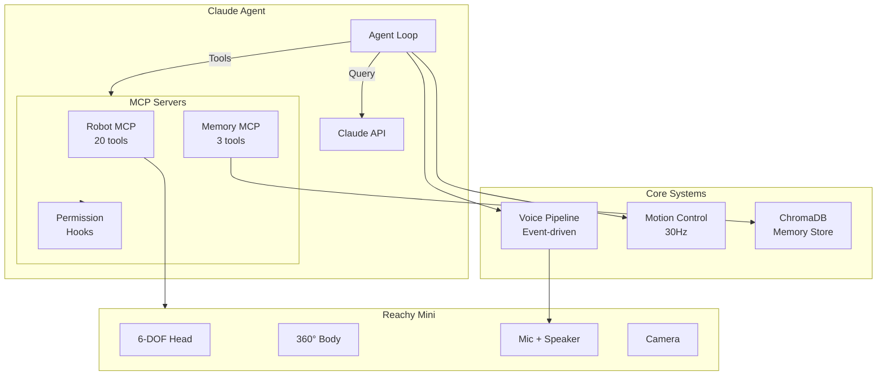

# Claude in the Shell v2

[](https://www.python.org/downloads/)
[](https://opensource.org/licenses/MIT)
[](#)
[](#)

**An embodied AI agent for the Reachy Mini desktop robot.** Claude runs on the robot's Raspberry Pi 4, using MCP tools to control motors, speak, listen, and perceive the world. The robot has personality, memory, and can hold natural voice conversations with barge-in support.

---

## Quick Navigation

| :rocket: **Getting Started** | :zap: **Quick Start** |
|---|---|
| [Getting Started Guide](getting-started.md) - Install and run your first conversation with Reachy | [Quick Start Tutorial](quick-start.md) - 5-minute tutorial to get up and running |

| :book: **User Guide** | :wrench: **API Reference** |
|---|---|
| [User Guide](user-guide/index.md) - Complete guide to using the agent | [API Reference](api-reference/index.md) - Detailed documentation for all MCP tools |

| :mortar_board: **Tutorials** | :gear: **Developer Guide** |
|---|---|
| [Tutorials](tutorials/index.md) - Step-by-step guides for common tasks | [Developer Guide](developer-guide/index.md) - Architecture, internals, and contributing |

| :computer: **Examples** | |
|---|---|
| [Code Examples](examples/index.md) - Working code samples | |

---

## Features

### Voice Interaction
- **Multi-persona wake words** - "Hey Motoko", "Hey Batou", "Hey Jarvis"
- **Barge-in support** - Interrupt the robot while it's speaking
- **Event-driven pipeline** - Easy to debug and extend
- **Automatic persona switching** - Each wake word activates a different personality

### Robot Control
- **20 MCP tools** for motor control, expressions, audio, and perception
- **Unified ReachyClient** interface abstracts hardware details
- **SDK-only communication** - Low latency via Zenoh (1-5ms)
- **Tool result caching** - 200ms cache avoids redundant queries

### Memory System
- **ChromaDB-backed** semantic memory with vector search
- **3 memory types**: CONVERSATION (30 days), FACT (permanent), CONTEXT (session)
- **Built-in context window** - Last 5 turns automatically included
- **Simple search API** - Query + optional type filter

### Motion Control
- **30Hz unified control loop** - Smooth, responsive movements
- **Idle behavior** - Perlin noise for organic "alive" feeling
- **Speech wobble** - Audio-reactive head movement during TTS
- **Emotion sequences** - Chain multiple expressions together

### MuJoCo Simulation
- **Physics-accurate simulation** - Develop without hardware
- **Real-time viewer** - 3D visualization with camera controls
- **Gymnasium environment** - Ready for reinforcement learning
- **Domain randomization** - Robust sim-to-real transfer

### Permissions
- **3-tier authorization** - AUTONOMOUS, CONFIRM, FORBIDDEN
- **Glob pattern matching** - Flexible tool permission rules
- **Audit logging** - Every tool call logged with decision

---

## Architecture Overview



---

## Hardware Platform

**Reachy Mini Wireless** (Raspberry Pi 4):

| Component | Specification |
|-----------|---------------|
| Head | 6 DOF (pitch, yaw, roll, z, 2 antennas) |
| Body | 360° continuous rotation |
| Camera | Wide-angle USB |
| Audio | 4-mic array + 5W speaker |
| Connectivity | WiFi |

---

## Running Modes

```bash
# Interactive text mode
python -m reachy_agent run

# Voice mode with barge-in
python -m reachy_agent run --voice

# Mock mode (no hardware)
python -m reachy_agent run --mock

# Simulation mode (MuJoCo)
python -m reachy_agent run --sim

# Simulation with 3D viewer
python -m reachy_agent run --sim --sim-viewer
```

---

## Technology Stack

| Layer | Technology | Purpose |
|-------|------------|---------|
| AI Model | Claude Haiku 4.5 | Fast, intelligent responses |
| Agent SDK | claude-agent-sdk | Official Claude SDK |
| MCP | FastMCP | Tool exposure protocol |
| Voice STT/TTS | OpenAI Realtime | WebSocket streaming |
| Wake Word | OpenWakeWord | Multi-model detection |
| Memory | ChromaDB | Vector semantic search |
| Embeddings | all-MiniLM-L6-v2 | 384-dim embeddings |
| Hardware | Reachy Mini SDK (Zenoh) | 1-5ms latency |
| Simulation | MuJoCo | Physics simulation |
| Config | Pydantic | Type-safe configuration |

---

## Next Steps

- **New to the project?** Start with the [Getting Started Guide](getting-started.md)
- **Want to dive in fast?** Check the [Quick Start Tutorial](quick-start.md)
- **Building something?** Browse the [API Reference](api-reference/index.md)
- **Contributing?** Read the [Developer Guide](developer-guide/index.md)

---

## License

MIT License - See [LICENSE](https://github.com/your-repo/claude-in-the-shell-v2/blob/main/LICENSE) for details.
