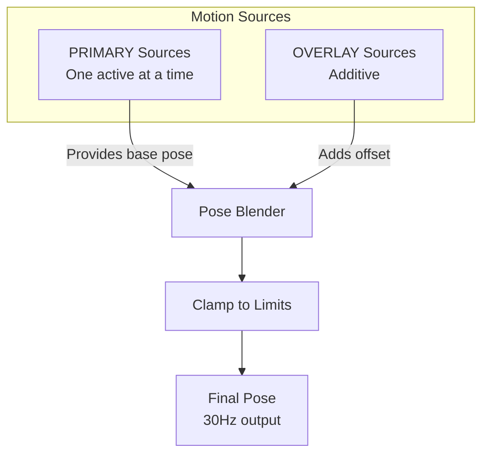

# Tutorial: Custom Behaviors

Create custom motion behaviors and emotion sequences.

**Time**: 30 minutes
**Prerequisites**: MuJoCo simulation set up, Python experience

## What You'll Learn

- Understand the motion control architecture
- Create custom idle behaviors
- Design emotion animations
- Build motion sequences
- Integrate behaviors with the agent

## Motion Control Architecture



**PRIMARY sources** (mutually exclusive):
- `idle` - Default look-around behavior
- `emotion` - Playing recorded animation
- `agent` - Direct control from MCP tools

**OVERLAY sources** (additive):
- `wobble` - Speech animation
- `nod` - Acknowledgment gestures

## Step 1: Understanding the Protocol

All motion sources implement this protocol:

```python
from typing import Protocol
from reachy_agent.motion.controller import MotionOutput, MotionSourceType

class MotionSource(Protocol):
    """Interface for motion sources."""

    @property
    def name(self) -> str:
        """Unique identifier for this source."""
        ...

    @property
    def source_type(self) -> MotionSourceType:
        """PRIMARY or OVERLAY."""
        ...

    @property
    def is_active(self) -> bool:
        """Whether currently producing output."""
        ...

    async def start(self) -> None:
        """Called when source becomes active."""
        ...

    async def stop(self) -> None:
        """Called when source is deactivated."""
        ...

    def tick(self) -> MotionOutput | None:
        """Called at 30Hz. Returns pose or None."""
        ...
```

## Step 2: Create a Custom Idle Behavior

Let's create a "scanning" idle behavior:

```python
# src/reachy_agent/motion/custom_idle.py

import math
from dataclasses import dataclass

from reachy_agent.motion.controller import (
    HeadPose,
    AntennaState,
    MotionOutput,
    MotionSourceType,
)


@dataclass
class ScanningIdle:
    """Idle behavior that scans left-right like searching."""

    name: str = "scanning_idle"
    source_type: MotionSourceType = MotionSourceType.PRIMARY

    # Configuration
    scan_speed: float = 0.3      # Speed of scanning
    scan_amplitude: float = 40.0  # How far to look left/right
    vertical_drift: float = 5.0   # Small vertical movement

    def __init__(self):
        self._active = False
        self._time = 0.0

    @property
    def is_active(self) -> bool:
        return self._active

    async def start(self) -> None:
        self._active = True
        self._time = 0.0

    async def stop(self) -> None:
        self._active = False

    def tick(self) -> MotionOutput | None:
        if not self._active:
            return None

        self._time += 1.0 / 30.0  # 30Hz tick

        # Sinusoidal scan left-right
        yaw = math.sin(self._time * self.scan_speed * 2 * math.pi) * self.scan_amplitude

        # Subtle vertical movement
        pitch = math.sin(self._time * self.scan_speed * 0.5 * 2 * math.pi) * self.vertical_drift

        # Antennas follow the scan
        antenna_angle = yaw * 0.3  # Reduced amplitude for antennas

        return MotionOutput(
            head=HeadPose(pitch=pitch, yaw=yaw, roll=0, z=0),
            antennas=AntennaState(left=antenna_angle, right=antenna_angle),
        )
```

### Test Your Behavior

```python
# test_custom_idle.py
import asyncio
from reachy_agent.motion.custom_idle import ScanningIdle

async def test():
    idle = ScanningIdle()
    await idle.start()

    for _ in range(90):  # 3 seconds at 30Hz
        output = idle.tick()
        if output:
            print(f"Yaw: {output.head.yaw:.1f}°")
        await asyncio.sleep(1/30)

    await idle.stop()

asyncio.run(test())
```

## Step 3: Create a Custom Emotion

Define an emotion as a sequence of keyframes:

```python
# src/reachy_agent/motion/custom_emotion.py

import asyncio
from dataclasses import dataclass, field

from reachy_agent.motion.controller import (
    HeadPose,
    AntennaState,
    MotionOutput,
    MotionSourceType,
)


@dataclass
class Keyframe:
    """A single pose in an emotion animation."""
    pitch: float = 0.0
    yaw: float = 0.0
    roll: float = 0.0
    z: float = 0.0
    antenna_left: float = 0.0
    antenna_right: float = 0.0
    duration: float = 0.5  # Time to reach this pose


@dataclass
class CustomEmotion:
    """Custom emotion animation from keyframes."""

    name: str
    keyframes: list[Keyframe]
    source_type: MotionSourceType = MotionSourceType.PRIMARY

    _active: bool = field(default=False, init=False)
    _frame_index: int = field(default=0, init=False)
    _frame_time: float = field(default=0.0, init=False)
    _prev_pose: HeadPose = field(default_factory=lambda: HeadPose(), init=False)

    @property
    def is_active(self) -> bool:
        return self._active and self._frame_index < len(self.keyframes)

    async def start(self) -> None:
        self._active = True
        self._frame_index = 0
        self._frame_time = 0.0
        self._prev_pose = HeadPose()

    async def stop(self) -> None:
        self._active = False

    def tick(self) -> MotionOutput | None:
        if not self.is_active:
            return None

        keyframe = self.keyframes[self._frame_index]
        self._frame_time += 1.0 / 30.0

        # Interpolation progress (0 to 1)
        t = min(1.0, self._frame_time / keyframe.duration)

        # Smooth interpolation (ease in-out)
        t = t * t * (3 - 2 * t)

        # Interpolate to target
        pose = HeadPose(
            pitch=self._lerp(self._prev_pose.pitch, keyframe.pitch, t),
            yaw=self._lerp(self._prev_pose.yaw, keyframe.yaw, t),
            roll=self._lerp(self._prev_pose.roll, keyframe.roll, t),
            z=self._lerp(self._prev_pose.z, keyframe.z, t),
        )

        antennas = AntennaState(
            left=keyframe.antenna_left * t,
            right=keyframe.antenna_right * t,
        )

        # Move to next keyframe when done
        if self._frame_time >= keyframe.duration:
            self._prev_pose = HeadPose(
                pitch=keyframe.pitch,
                yaw=keyframe.yaw,
                roll=keyframe.roll,
                z=keyframe.z,
            )
            self._frame_index += 1
            self._frame_time = 0.0

        return MotionOutput(head=pose, antennas=antennas)

    @staticmethod
    def _lerp(a: float, b: float, t: float) -> float:
        """Linear interpolation."""
        return a + (b - a) * t


# Example: Create a "surprised" emotion
surprised_emotion = CustomEmotion(
    name="custom_surprised",
    keyframes=[
        # Quick back movement
        Keyframe(pitch=15, yaw=0, roll=0, z=20, antenna_left=60, antenna_right=60, duration=0.2),
        # Hold
        Keyframe(pitch=10, yaw=0, roll=0, z=15, antenna_left=45, antenna_right=45, duration=0.5),
        # Return to neutral
        Keyframe(pitch=0, yaw=0, roll=0, z=0, antenna_left=0, antenna_right=0, duration=0.3),
    ]
)
```

## Step 4: Create an OVERLAY Behavior

OVERLAY sources add to the primary pose. Let's make a "breathing" overlay:

```python
# src/reachy_agent/motion/breathing.py

import math
from dataclasses import dataclass

from reachy_agent.motion.controller import (
    PoseOffset,
    MotionOutput,
    MotionSourceType,
)


@dataclass
class BreathingOverlay:
    """Subtle breathing motion overlay."""

    name: str = "breathing"
    source_type: MotionSourceType = MotionSourceType.OVERLAY

    # Configuration
    breath_rate: float = 0.2      # Breaths per second
    z_amplitude: float = 3.0      # mm of z movement
    roll_amplitude: float = 1.0   # degrees of roll

    def __init__(self):
        self._active = False
        self._time = 0.0

    @property
    def is_active(self) -> bool:
        return self._active

    async def start(self) -> None:
        self._active = True
        self._time = 0.0

    async def stop(self) -> None:
        self._active = False

    def tick(self) -> MotionOutput | None:
        if not self._active:
            return None

        self._time += 1.0 / 30.0

        # Breathing cycle
        phase = self._time * self.breath_rate * 2 * math.pi
        breath = (math.sin(phase) + 1) / 2  # 0 to 1

        return MotionOutput(
            head=PoseOffset(
                pitch=0,
                yaw=0,
                roll=math.sin(phase * 0.5) * self.roll_amplitude,
                z=breath * self.z_amplitude,
            )
        )
```

## Step 5: Register Custom Behaviors

Add your behaviors to the blend controller:

```python
# In your agent setup code

from reachy_agent.motion.controller import BlendController
from reachy_agent.motion.custom_idle import ScanningIdle
from reachy_agent.motion.breathing import BreathingOverlay

async def setup_custom_motion(blend_controller: BlendController):
    # Replace default idle with scanning
    await blend_controller.set_primary(ScanningIdle())

    # Add breathing overlay
    await blend_controller.add_overlay(BreathingOverlay())
```

## Step 6: Create Emotion Sequences

Chain emotions together:

```python
from reachy_agent.motion.controller import EmotionSequence

# Define a complex emotional response
discovery_sequence = EmotionSequence(
    name="discovery",
    emotions=["curious", "surprised", "happy"],
    delays=[0.5, 0.3],  # Delays between emotions
)

# Play it
await blend_controller.set_primary(discovery_sequence)
```

## Step 7: Export Emotions to JSON

Save custom emotions for reuse:

```python
import json

def export_emotion(emotion: CustomEmotion, path: str):
    """Export emotion to JSON file."""
    data = {
        "name": emotion.name,
        "fps": 30,
        "frames": [
            {
                "pitch": kf.pitch,
                "yaw": kf.yaw,
                "roll": kf.roll,
                "z": kf.z,
                "antenna_left": kf.antenna_left,
                "antenna_right": kf.antenna_right,
            }
            for kf in emotion.keyframes
            for _ in range(int(kf.duration * 30))  # Expand to frames
        ]
    }
    with open(path, "w") as f:
        json.dump(data, f, indent=2)


# Export our custom surprised emotion
export_emotion(surprised_emotion, "data/emotions/custom_surprised.json")
```

## Step 8: Integration with Agent

Register custom behaviors in the agent:

```python
# src/reachy_agent/motion/registry.py

from reachy_agent.motion.custom_idle import ScanningIdle
from reachy_agent.motion.breathing import BreathingOverlay

CUSTOM_PRIMARY_SOURCES = {
    "scanning": ScanningIdle,
}

CUSTOM_OVERLAY_SOURCES = {
    "breathing": BreathingOverlay,
}
```

Then in agent configuration:
```yaml
motion:
  default_idle: scanning  # Use our custom idle
  overlays: [breathing]   # Enable breathing overlay
```

## Tips for Good Behaviors

### 1. Smooth Movements
- Use easing functions (ease-in-out)
- Avoid instant position changes
- Keep velocities reasonable

### 2. Natural Timing
- Idle behaviors: slow, continuous
- Emotions: quick but not jarring
- Overlays: subtle, rhythmic

### 3. Stay Within Limits
```python
# Always clamp to hardware limits
LIMITS = {
    "pitch": (-45, 35),
    "yaw": (-60, 60),
    "roll": (-35, 35),
    "z": (0, 50),
    "antenna": (-150, 150),
}

def clamp(value: float, joint: str) -> float:
    low, high = LIMITS[joint]
    return max(low, min(high, value))
```

### 4. Test in Simulation First
```bash
python -m reachy_agent run --sim --sim-viewer
```

## What's Next?

You've learned custom behaviors! Explore:

- [Motion Control Architecture](../developer-guide/motion-system.md)
- [API Reference](../api-reference/motion-control.md)
- [Developer Guide](../developer-guide/index.md)

## Summary

In this tutorial, you learned to:

- [x] Understand motion control architecture
- [x] Create custom PRIMARY behaviors (idle)
- [x] Design keyframe-based emotions
- [x] Build OVERLAY behaviors (breathing)
- [x] Register behaviors with the controller
- [x] Create emotion sequences
- [x] Export emotions to JSON
- [x] Integrate with the agent

---

**Congratulations!** You've completed the custom behaviors tutorial.
