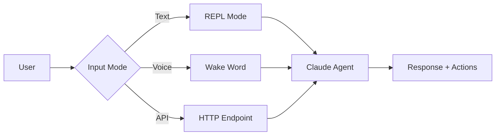

# User Guide

Welcome to the Claude in the Shell v2 User Guide. This section covers everything you need to know to use the Reachy agent effectively.

## Guide Contents

### Getting Set Up

- **[Installation](installation.md)** - Detailed installation instructions for all platforms
- **[Configuration](../getting-started.md#configuration)** - Customize agent behavior

### Core Features

- **[Voice Control](voice-control.md)** - Multi-persona wake words, barge-in, and voice interaction
- **[Robot Movements](robot-movements.md)** - Control head, body, and antennas
- **[Memory System](memory-system.md)** - Store and retrieve semantic memories
- **[Simulation](simulation.md)** - MuJoCo physics simulation for development

### Help & Support

- **[Troubleshooting](troubleshooting.md)** - Common issues and solutions

---

## Quick Overview

### What Can The Agent Do?

Claude in the Shell v2 is an embodied AI that can:

| Capability | Description |
|------------|-------------|
| **Talk** | Natural voice conversations with wake words |
| **Move** | Head movements, body rotation, antenna expressions |
| **Remember** | Semantic memory that persists across sessions |
| **See** | Camera capture and image analysis |
| **Listen** | Sound direction detection and speech recognition |
| **Express** | 81 emotion animations from happy to skeptical |

### Interaction Modes



**Text Mode** - Type commands in terminal
```bash
python -m reachy_agent run --mock
```

**Voice Mode** - Say wake words to interact
```bash
python -m reachy_agent run --mock --voice
```

**Simulation Mode** - Use physics simulation
```bash
python -m reachy_agent run --sim --sim-viewer
```

### Permission Tiers

The agent uses a permission system to control tool access:

| Tier | Behavior | Examples |
|------|----------|----------|
| **AUTONOMOUS** | Executes immediately | Movement, emotions, status |
| **CONFIRM** | Asks user first | Store permanent memory, delete memory |
| **FORBIDDEN** | Never allowed | System commands, shell access |

When a CONFIRM tool is called:
```
🔐 Permission Required
   Tool: store_memory
   Args: {"content": "User likes jazz", "type": "fact"}
   Reason: Storing permanent memories requires approval
   Allow? [y/N]: y
```

### Memory Types

| Type | Expiry | Use Case |
|------|--------|----------|
| **FACT** | Never | User preferences, important info |
| **CONVERSATION** | 30 days | Dialog history, discussions |
| **CONTEXT** | End of day | Current task, session state |

---

## Navigation

<div class="grid cards" markdown>

-   :material-microphone: **[Voice Control](voice-control.md)**

    Wake words, personas, and voice interaction

-   :material-robot: **[Robot Movements](robot-movements.md)**

    Head, body, and antenna control

-   :material-brain: **[Memory System](memory-system.md)**

    Store and search memories

-   :material-cube-outline: **[Simulation](simulation.md)**

    MuJoCo physics simulation

-   :material-alert-circle: **[Troubleshooting](troubleshooting.md)**

    Common issues and solutions

</div>

---

## Tips for Best Results

### 1. Be Specific
Instead of "move your head", try "look up 20 degrees and left 30 degrees"

### 2. Use Natural Language
The agent understands context: "remember that" instead of "store_memory"

### 3. Chain Actions
"Look curious, then nod, then say 'interesting!'"

### 4. Check Status
"What's your current position?" or "How's your battery?"

### 5. Explore Emotions
"Show me all the emotions you can express"

---

**Ready to learn more?** Start with [Voice Control](voice-control.md) or [Robot Movements](robot-movements.md).
