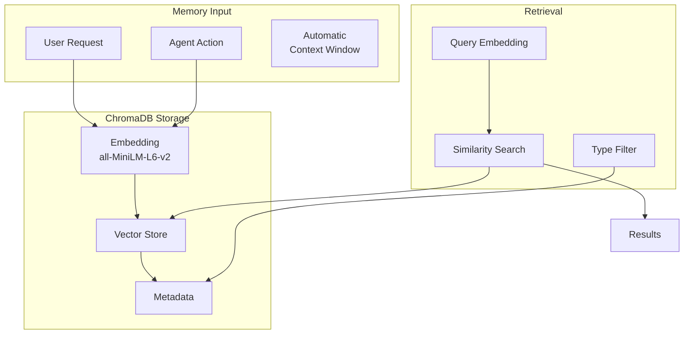
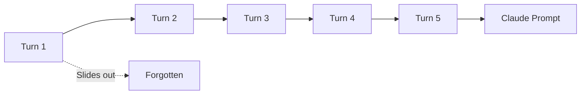

# Memory System Guide

The memory system enables the agent to store and retrieve information across conversations using semantic search. This guide covers how memory works and how to use it effectively.

## Overview



## Memory Types

| Type | Expiry | Use Case | Examples |
|------|--------|----------|----------|
| **FACT** | Never | Important permanent info | "User's name is Alex", "User is allergic to peanuts" |
| **CONVERSATION** | 30 days | Dialog history | "We discussed AI ethics on Monday" |
| **CONTEXT** | End of day | Session-specific | "Currently helping with Python code" |

### FACT Memories
- Permanent storage
- User preferences, important information
- Requires CONFIRM permission to store

### CONVERSATION Memories
- Auto-expires after 30 days
- Dialog history and discussions
- Good for "remember when we talked about..."

### CONTEXT Memories
- Expires at end of day
- Current task, session state
- Automatically cleaned up

## Using Memory

### Storing Memories

**Through conversation:**
```
> Remember that my favorite color is blue

I'll remember that your favorite color is blue.
🔐 Permission Required: store_memory
   Allow? [y/N]: y

I've stored that as a permanent fact!
```

**Explicit storage:**
```
> Store a fact: I'm learning Python

I'll save that you're learning Python.
🔐 Permission Required: store_memory
   Allow? [y/N]: y

Done! I'll remember that.
```

### Searching Memories

**Natural language:**
```
> What do you remember about my preferences?

Let me search my memory...

I found these memories:
1. Your favorite color is blue (fact, score: 0.92)
2. You prefer morning meetings (fact, score: 0.78)
3. You're learning Python (fact, score: 0.65)
```

**Specific type:**
```
> Search your conversation memories for discussions about AI

Searching conversation memories...

Found 2 relevant conversations:
1. "We discussed AI ethics and alignment" (score: 0.89)
2. "You asked about machine learning basics" (score: 0.74)
```

### Forgetting Memories

```
> Forget that my favorite color is blue

I found a memory about your favorite color.
🔐 Permission Required: forget_memory
   Allow? [y/N]: y

I've forgotten that memory.
```

## Context Window

The agent automatically maintains a **context window** of the last 5 conversation turns. This is separate from stored memories and doesn't require explicit storage.



**Features:**
- Last 5 turns always included in prompt
- No storage required
- Resets on session end
- Automatic management

**Configuration:**
```yaml
memory:
  context_window_size: 5  # Number of turns to keep
```

## How Semantic Search Works

### 1. Embedding
When you store a memory, the text is converted to a 384-dimensional vector using the `all-MiniLM-L6-v2` model:

```
"User's favorite color is blue"
    ↓ [Embedding]
[0.023, -0.15, 0.87, ..., 0.12]  # 384 numbers
```

### 2. Storage
The vector is stored in ChromaDB along with:
- Original text
- Memory type
- Creation timestamp
- Custom metadata

### 3. Search
When searching, your query is also embedded and compared:

```
Query: "color preferences"
    ↓ [Embedding]
[0.019, -0.12, 0.82, ..., 0.15]  # Similar to "favorite color"
    ↓ [Cosine Similarity]
Score: 0.92  # High match!
```

### Search Parameters

| Parameter | Default | Description |
|-----------|---------|-------------|
| `query` | (required) | Search text |
| `memory_type` | None | Filter by type (fact, conversation, context) |
| `limit` | 5 | Max results |
| `min_score` | 0.3 | Minimum relevance (0-1) |

## Best Practices

### 1. Be Specific When Storing

```
# Good - specific and searchable
"User Alex prefers dark mode in all applications"

# Less useful - too vague
"User likes dark"
```

### 2. Use Appropriate Types

```
# FACT - permanent, important
"Alex is allergic to shellfish" → fact

# CONVERSATION - discussion context
"We talked about project deadlines" → conversation

# CONTEXT - session-specific
"Currently debugging auth module" → context
```

### 3. Add Metadata When Relevant

The agent can store custom metadata:

```python
store_memory(
    content="User prefers Python over JavaScript",
    memory_type="fact",
    metadata={
        "category": "programming",
        "confidence": "high"
    }
)
```

### 4. Regular Cleanup

Context memories auto-expire, but you might want to clean up old facts:

```
> List all my stored facts

Found 15 facts...

> Forget the outdated ones about my old job
```

### 5. Check Before Storing Duplicates

```
> Remember that I like coffee

Let me check if I already know this...
I found an existing memory: "User enjoys coffee in the morning"
Should I update it or store a new one?
```

## Storage Location

Memories are stored in ChromaDB at:
```
~/.reachy/memory/chroma.sqlite3
```

**To reset all memories:**
```bash
rm -rf ~/.reachy/memory
```

**To backup:**
```bash
cp -r ~/.reachy/memory ~/.reachy/memory-backup
```

## Privacy & Security

### What's Stored
- Text content you explicitly ask to remember
- Conversation context (temporary)
- Metadata (timestamps, types)

### What's NOT Stored
- Audio recordings
- Images
- API keys or credentials
- System data

### Permission System

Memory operations use the permission system:

| Operation | Permission |
|-----------|------------|
| Search | AUTONOMOUS |
| Store | CONFIRM |
| Forget | CONFIRM |

This means storing and deleting requires explicit user approval.

## Troubleshooting

### "Memory not found"

If searching returns no results:
1. Try different search terms
2. Check if the memory type filter is too restrictive
3. Lower the `min_score` threshold

### "ChromaDB initialization failed"

```bash
# Reset memory database
rm -rf ~/.reachy/memory
# Restart the agent
```

### Slow Search Performance

For large memory collections:
1. Use type filters to narrow search
2. Reduce result limit
3. Consider cleanup of old context memories

### Duplicate Memories

The agent doesn't automatically deduplicate. Ask it to:
```
> Check if you already know my email before storing it
```

## API Reference

### store_memory

```python
store_memory(
    content: str,           # What to remember
    memory_type: str,       # "fact", "conversation", or "context"
    metadata: dict | None   # Optional key-value pairs
) -> dict
```

### search_memory

```python
search_memory(
    query: str,              # Search query
    memory_type: str | None, # Optional filter
    limit: int = 5,          # Max results
    min_score: float = 0.3   # Minimum relevance
) -> dict
```

### forget_memory

```python
forget_memory(
    memory_id: str  # UUID of memory to delete
) -> dict
```

---

**Next**: Learn about [Simulation](simulation.md) or check the [API Reference](../api-reference/memory-tools.md).
