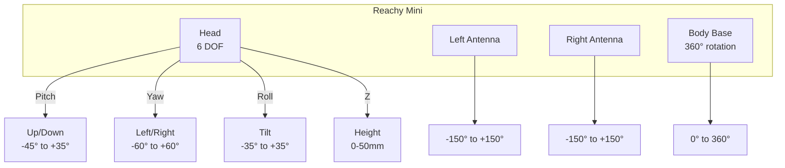
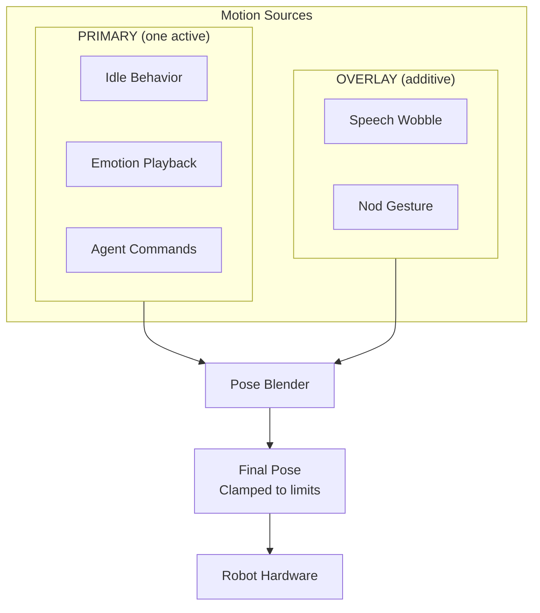

# Robot Movements Guide

Control the Reachy Mini robot's head, body, and antennas. This guide covers all movement capabilities and best practices.

## Overview

The Reachy Mini has the following movable parts:



## Joint Limits

| Joint | Minimum | Maximum | Unit | Description |
|-------|---------|---------|------|-------------|
| Head Pitch | -45 | +35 | degrees | Look down/up |
| Head Yaw | -60 | +60 | degrees | Look left/right |
| Head Roll | -35 | +35 | degrees | Tilt head |
| Head Z | 0 | 50 | mm | Raise/lower head |
| Body Rotation | 0 | 360 | degrees | Continuous |
| Left Antenna | -150 | +150 | degrees | Expression |
| Right Antenna | -150 | +150 | degrees | Expression |

## Basic Movements

### Move Head

Direct head positioning with absolute angles:

```
> Move your head to look up
"I'll look up for you."
*moves head with pitch: 20°*

> Look down and to the right
"Looking down and right."
*moves head with pitch: -30°, yaw: 40°*

> Tilt your head curiously
"Like this?"
*moves head with roll: 15°*
```

**Tool syntax:**
```python
move_head(pitch=-10, yaw=30, roll=0, duration=1.0)
```

### Look At Point

Look at a 3D point in space (robot frame coordinates):

```
> Look at something 1 meter ahead and slightly up
"Looking there now."
*calculates angles and moves head*
```

**Coordinate system:**
- X: Left/right (positive = right)
- Y: Up/down (positive = down)
- Z: Forward/back (positive = forward)

**Tool syntax:**
```python
look_at(x=0.0, y=-0.2, z=1.0, duration=1.0)
```

### Rotate Body

360° continuous body rotation:

```
> Turn to face behind you
"Rotating 180 degrees."
*body rotates 180°*

> Turn back to face me
"Turning back."
*body rotates to 0°*
```

**Tool syntax:**
```python
rotate_body(angle=180, duration=2.0)
```

### Reset Position

Return to neutral pose:

```
> Return to neutral
"Resetting to neutral position."
*head centers, body faces forward*
```

**Tool syntax:**
```python
reset_position(duration=1.0)
```

## Expressions

### Antennas

The antennas are key for expression:

```
> Raise your antennas excitedly
*antennas move to +60°, +60°*

> Droop your antennas sadly
*antennas move to -90°, -90°*

> Tilt them asymmetrically
*antennas move to +45°, -30°*
```

**Common antenna positions:**
| Expression | Left | Right |
|------------|------|-------|
| Neutral | 0° | 0° |
| Excited | +60° | +60° |
| Sad | -90° | -90° |
| Curious | +45° | +30° |
| Confused | -30° | +45° |

**Tool syntax:**
```python
set_antennas(left=60, right=60)
```

### Nod (Yes)

Affirmative gesture:

```
> Nod yes
*performs nodding motion*

> Nod enthusiastically
*performs larger nodding motion*
```

**Tool syntax:**
```python
nod(intensity=1.0)  # 0.0-2.0
```

### Shake (No)

Negative gesture:

```
> Shake your head no
*performs head shake*

> Shake emphatically
*performs larger head shake*
```

**Tool syntax:**
```python
shake(intensity=1.0)  # 0.0-2.0
```

## Emotions

### Play Single Emotion

81 emotions available in categories:

**Basic emotions:**
- happy, sad, curious, surprised, confused, tired

**Social:**
- greeting, farewell, acknowledgment, thinking

**Reactions:**
- yes, no, maybe, excitement, disappointment

**Complex:**
- interested, skeptical, amused, concerned

```
> Show me you're curious
*plays curious animation*

> Express happiness
*plays happy animation*

> Look surprised
*plays surprised animation*
```

**Tool syntax:**
```python
play_emotion(emotion_name="curious")
```

### Play Emotion Sequence

Chain multiple emotions:

```
> First look curious, then think, then show excitement
*plays: curious → thinking → excitement*
```

**Tool syntax:**
```python
play_sequence(
    emotions=["curious", "thinking", "excitement"],
    delays=[0.5, 0.5]  # Delays between emotions
)
```

## Motion Control System

### How It Works

The motion system runs at 30Hz with two source types:



**PRIMARY sources** (mutually exclusive):
- `idle` - Default look-around behavior
- `emotion` - Playing recorded animation
- `agent` - Direct control from MCP tools

**OVERLAY sources** (additive):
- `wobble` - Speech animation during TTS
- `nod` - Acknowledgment gestures

### Idle Behavior

When not actively commanded, the robot exhibits idle behavior:
- Subtle head movements using Perlin noise
- Small antenna variations
- Creates an "alive" feeling

Configure in `config/default.yaml`:
```yaml
motion:
  idle:
    speed: 0.1        # Movement speed
    amplitude: 0.3    # Movement range (fraction of limits)
    antenna_drift: 0.2  # Antenna variation
```

### Speech Wobble

During text-to-speech, the head adds subtle audio-reactive movement:
- Pitch/roll oscillation modulated by audio level
- Makes speech more natural
- Automatically enabled/disabled with TTS

## Best Practices

### 1. Use Appropriate Duration

| Movement Type | Recommended Duration |
|---------------|---------------------|
| Small adjustment | 0.5s |
| Normal movement | 1.0s |
| Large movement | 1.5-2.0s |
| Full body rotation | 2.0-3.0s |

### 2. Consider the Context

Match movement to conversation:
```
> "I'm not sure about that"
→ Tilt head, hesitant antenna position

> "That's a great idea!"
→ Nod, excited antenna position, happy emotion
```

### 3. Avoid Rapid Successive Commands

Allow movements to complete:
```
# Good
"Move up, wait, then look left"

# May cause issues
"Up left right down" (rapid fire)
```

### 4. Use Natural Language

The agent understands context:
```
# These all work
"Look up"
"Move your head upward"
"Tilt your gaze toward the ceiling"
"raise your head"
```

### 5. Combine with Emotions

Movement + emotion = more expressive:
```
> "Look curious and tilt your head"
*plays curious emotion with head tilt*
```

## Status and Monitoring

### Get Current Position

```
> What's your current position?

My current pose:
- Head: pitch=5°, yaw=-10°, roll=0°, z=10mm
- Body: 0°
- Antennas: left=15°, right=12°
```

**Tool syntax:**
```python
get_position()  # Returns all joint angles
get_status()    # Returns full robot state
```

### Check Limits

```
> What are your movement limits?

My joint limits:
- Head Pitch: -45° to +35°
- Head Yaw: -60° to +60°
- Head Roll: -35° to +35°
- Head Z: 0mm to 50mm
- Body: 0° to 360° (continuous)
- Antennas: -150° to +150°
```

## Troubleshooting

### Movement Not Executing

1. **Check if awake**: Robot must be awake (motors enabled)
   ```
   > Wake up
   ```

2. **Check limits**: Movement may be clamped
   ```
   > What are your limits?
   ```

3. **Check status**:
   ```
   > What's your status?
   ```

### Jerky Movement

1. Increase movement duration
2. Check motion control tick rate (should be 30Hz)
3. Reduce idle behavior amplitude

### Robot Not Responding

1. Check connection (SDK mode)
2. Verify mock mode is enabled (development)
3. Check error logs

---

**Next**: Learn about [Memory System](memory-system.md) or [Simulation](simulation.md).
