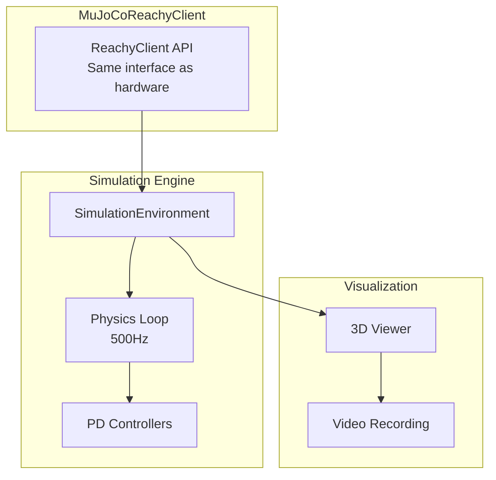

# Simulation Guide

The MuJoCo simulation subsystem provides physics-accurate simulation of the Reachy Mini robot, enabling development and testing without physical hardware.

## Overview



## Prerequisites

Install simulation dependencies:

```bash
uv pip install -e ".[sim]"
```

This installs:
- `gymnasium[mujoco]` - MuJoCo physics engine
- `imageio` / `imageio-ffmpeg` - Video recording
- `glfw` - Window management

### GPU Support (Optional)

For NVIDIA GPU acceleration:
```bash
pip install mujoco-py
```

### Headless Mode

For servers without display:
```bash
export MUJOCO_GL=egl  # or osmesa
```

## Quick Start

### Run with Simulation

```bash
# Basic simulation (no viewer)
python -m reachy_agent run --sim

# With 3D viewer
python -m reachy_agent run --sim --sim-viewer

# Fast-forward (non-realtime)
python -m reachy_agent run --sim --no-sim-realtime
```

### Verify Simulation

```bash
python -m reachy_agent check
```

Should show:
```
✅ MuJoCo: Available (version 3.0.0)
✅ Simulation model: Loaded
✅ Physics: Running at 500Hz
```

## Features

### Physics-Accurate Movement

The simulation uses MuJoCo's physics engine:
- Accurate joint dynamics
- Collision detection
- Gravity and inertia
- PD position control

```
> Move your head to look up

*In simulation, the head smoothly rotates up following
real physics, with momentum and settling*
```

### Real-time Viewer

The 3D viewer provides:
- Orbit, pan, zoom camera controls
- Joint angle overlay
- Real-time physics visualization
- Multiple camera presets

**Keyboard controls:**
| Key | Action |
|-----|--------|
| `Tab` | Cycle camera presets |
| `Space` | Pause/resume |
| `R` | Reset to initial pose |
| `J` | Toggle joint overlay |
| `Escape` | Close viewer |

**Mouse controls:**
| Action | Effect |
|--------|--------|
| Left drag | Orbit camera |
| Right drag | Pan camera |
| Scroll | Zoom |

### Video Recording

Record simulation for documentation or debugging:

```python
from reachy_agent.simulation.viewer import SimulationViewer

viewer = SimulationViewer(model, data)
viewer.start()
viewer.start_recording()

# ... run simulation ...

frames = viewer.stop_recording()
viewer.save_video("output.mp4", fps=30, frames=frames)
```

## Robot Model

### Kinematic Chain

```
world
└── base (body_rotation: hinge, -180° to +180°)
    └── torso
        └── head_lift (head_z: slide, 0-50mm)
            └── head_yaw_link (head_yaw: hinge, -60° to +60°)
                └── head_pitch_link (head_pitch: hinge, -45° to +35°)
                    └── head_roll_link (head_roll: hinge, -35° to +35°)
                        └── head
                            ├── antenna_left_base (antenna_left: hinge, -150° to +150°)
                            └── antenna_right_base (antenna_right: hinge, -150° to +150°)
```

### Joints

| Joint | Type | Limits | Default |
|-------|------|--------|---------|
| body_rotation | hinge | ±180° | 0° |
| head_z | slide | 0-50mm | 0mm |
| head_yaw | hinge | ±60° | 0° |
| head_pitch | hinge | -45° to +35° | 0° |
| head_roll | hinge | ±35° | 0° |
| antenna_left | hinge | ±150° | 0° |
| antenna_right | hinge | ±150° | 0° |

### PD Controllers

Each joint has a position-controlled actuator:

| Actuator | Kp | Kv | Purpose |
|----------|----|----|---------|
| body_rotation | 200 | 20 | Base rotation |
| head_z | 500 | 50 | Head height |
| head_yaw | 100 | 10 | Left/right |
| head_pitch | 100 | 10 | Up/down |
| head_roll | 100 | 10 | Tilt |
| antenna_left | 50 | 5 | Expression |
| antenna_right | 50 | 5 | Expression |

### Sensors

| Sensor | Type | Description |
|--------|------|-------------|
| *_pos | jointpos | Position for each joint |
| *_vel | jointvel | Velocity for each joint |
| head_accel | accelerometer | 3-axis on head |
| head_gyro | gyro | 3-axis on head |
| head_camera | camera | RGB (90° FOV) |

## Configuration

In `config/default.yaml`:

```yaml
simulation:
  # Model path (relative to project root)
  model_path: data/models/reachy_mini/reachy_mini.xml

  # Physics settings
  timestep: 0.002     # 500Hz physics
  n_substeps: 4       # Physics substeps per step
  realtime: true      # Match wall clock time

  # Viewer settings
  viewer: false       # Enable by default
  headless: false     # No display mode

  # Rendering
  render:
    width: 640
    height: 480
    quality: medium   # low, medium, high
    shadows: true
    antialiasing: true

  # Physics tuning
  physics:
    gravity: [0, 0, -9.81]
    friction: 0.8
    damping: 1.0

  # Recording
  recording:
    fps: 30
    format: mp4
```

## Advanced Features

### Domain Randomization

For robust sim-to-real transfer, randomize physical parameters:

```python
from reachy_agent.simulation.config import DomainRandomizationConfig

config = DomainRandomizationConfig(
    enabled=True,
    mass_range=(0.8, 1.2),      # ±20% mass variation
    friction_range=(0.5, 1.2),  # Friction variation
    noise_std=0.01,             # Sensor noise
)
```

**Randomized parameters:**
- Joint friction
- Link masses
- Actuator gains
- Sensor noise

### Parallel Simulation

Run multiple environments for batch processing or RL:

```python
from reachy_agent.simulation import ParallelSimulation

parallel = ParallelSimulation(n_envs=8)
observations = parallel.reset()

for _ in range(1000):
    actions = policy(observations)
    observations, rewards, dones = parallel.step(actions)
```

### Gymnasium Environment

For reinforcement learning integration:

```python
from reachy_agent.simulation import ReachyGymEnv

env = ReachyGymEnv()
obs, info = env.reset()

for _ in range(1000):
    action = env.action_space.sample()
    obs, reward, terminated, truncated, info = env.step(action)

    if terminated or truncated:
        obs, info = env.reset()
```

**Action Space:**
- 7 continuous actions (one per joint)
- Range: [-1, 1] (scaled to joint limits)

**Observation Space:**
- Joint positions (7)
- Joint velocities (7)
- Accelerometer (3)
- Gyroscope (3)

## Python API

### MuJoCoReachyClient

Drop-in replacement for hardware client:

```python
from reachy_agent.simulation import MuJoCoReachyClient

client = MuJoCoReachyClient(
    model_path="data/models/reachy_mini/reachy_mini.xml",
    realtime=True,
    viewer=True,
)

await client.connect()
await client.wake_up()

# Same API as hardware client
await client.move_head(pitch=10, yaw=20, roll=0, duration=1.0)
await client.play_emotion("happy")
await client.rotate_body(angle=90, duration=2.0)

await client.disconnect()
```

### SimulationEnvironment

Low-level access:

```python
from reachy_agent.simulation.environment import SimulationEnvironment

env = SimulationEnvironment(timestep=0.002, realtime=False)
await env.start()

# Direct joint control
await env.move_joints({"head_pitch": 15, "head_yaw": 30}, duration=0.5)

# Read state
positions = await env.get_joint_positions()
velocities = await env.get_joint_velocities()
sensors = await env.get_sensor_data()

await env.stop()
```

### SimulationViewer

Standalone viewer control:

```python
from reachy_agent.simulation.viewer import SimulationViewer

viewer = SimulationViewer(model, data)
viewer.start()

# Camera control
viewer.set_camera_preset("front")  # front, side, top, iso
viewer.orbit(azimuth=45, elevation=30)
viewer.zoom(distance=1.5)

# Overlays
viewer.toggle_joint_overlay()
viewer.set_label("Testing emotion: happy")

# Recording
viewer.start_recording()
# ... simulation runs ...
frames = viewer.stop_recording()
viewer.save_video("demo.mp4", fps=30, frames=frames)

viewer.stop()
```

## Performance

### Timing

| Component | Rate | Notes |
|-----------|------|-------|
| Physics | 500Hz | 2ms timestep, 4 substeps |
| Control | 30Hz | Motion blend controller |
| Viewer | 60Hz | Display refresh |
| Recording | 30Hz | Video output |

### Optimization Tips

1. **Disable viewer for batch runs:**
   ```bash
   python -m reachy_agent run --sim  # No --sim-viewer
   ```

2. **Use fast-forward mode:**
   ```bash
   python -m reachy_agent run --sim --no-sim-realtime
   ```

3. **Reduce render quality:**
   ```yaml
   simulation:
     render:
       quality: low
       shadows: false
   ```

4. **Use headless rendering:**
   ```bash
   export MUJOCO_GL=egl
   ```

## Testing

Run simulation-specific tests:

```bash
# All simulation tests
pytest tests/test_simulation.py -v

# Performance benchmarks
pytest tests/test_simulation.py::TestSimulationPerformance -v

# Skip if MuJoCo not available
pytest tests/test_simulation.py -v --ignore-mujoco-skip
```

## Troubleshooting

### "MuJoCo not found"

```bash
# Install with gymnasium
pip install gymnasium[mujoco]

# Or install MuJoCo directly
pip install mujoco
```

### Viewer Window Not Opening

```bash
# Check display
echo $DISPLAY

# For SSH sessions, use X forwarding
ssh -X user@host

# Or use headless mode
export MUJOCO_GL=egl
```

### Slow Simulation

1. Check `realtime: false` for batch processing
2. Reduce physics timestep if acceptable
3. Disable viewer when not needed

### Physics Instability

1. Increase physics substeps
2. Reduce control gains (Kp, Kv)
3. Check joint limits aren't being violated

### Video Recording Issues

```bash
# Install ffmpeg
sudo apt-get install ffmpeg  # Linux
brew install ffmpeg          # macOS

# Or use imageio-ffmpeg
pip install imageio-ffmpeg
```

---

**Next**: Check out [MuJoCo Setup Tutorial](../tutorials/mujoco-setup.md) or the [API Reference](../api-reference/index.md).
