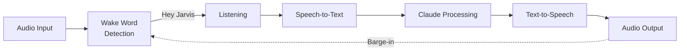

# Voice Control Guide

The voice pipeline enables natural conversations with wake word detection and barge-in support. This guide covers setup, configuration, and usage.

## Overview



**Key Features:**
- Multi-persona wake words
- Barge-in support (interrupt while speaking)
- Event-driven architecture
- Debug mode for troubleshooting

## Prerequisites

Install voice dependencies:

```bash
uv pip install -e ".[voice]"
```

Set up OpenAI API key (for Realtime STT/TTS):

```bash
# In .env file
OPENAI_API_KEY=sk-...
```

## Quick Start

Start voice mode:

```bash
python -m reachy_agent run --mock --voice
```

Say one of the wake words:
- **"Hey Jarvis"** - Default assistant persona
- **"Hey Motoko"** - Ghost in the Shell inspired
- **"Hey Batou"** - Alternative persona

The robot will respond and listen for your command.

## Wake Words and Personas

Each wake word activates a different persona with unique personality:

### Jarvis (Default)
- **Wake word**: "Hey Jarvis"
- **Voice**: Echo (male)
- **Personality**: Helpful, professional assistant

### Motoko
- **Wake word**: "Hey Motoko"
- **Voice**: Nova (female)
- **Personality**: Analytical, philosophical

### Batou
- **Wake word**: "Hey Batou"
- **Voice**: Onyx (male)
- **Personality**: Direct, action-oriented

## Voice Interaction Flow

### Normal Conversation

```
1. User: "Hey Jarvis"
   → Wake word detected, robot starts listening

2. User: "What's the weather like?"
   → Speech transcribed and sent to Claude

3. Claude: "I don't have access to weather data, but..."
   → Response converted to speech

4. Robot speaks response
   → Returns to wake word detection
```

### Barge-in (Interruption)

```
1. Robot: "Let me tell you about the history of..."
   → Robot is speaking

2. User: "Hey Jarvis"
   → Wake word detected DURING speech
   → Speech interrupted immediately

3. User: "Actually, just give me a summary"
   → New request processed
```

## Configuration

### Basic Settings

In `config/default.yaml`:

```yaml
voice:
  personas: [motoko, batou, jarvis]  # Available personas
  wake_sensitivity: 0.5              # 0.0-1.0, higher = more sensitive
  silence_threshold: 0.3             # Seconds of silence to end listening
  max_listen_time: 30.0              # Maximum listening duration

openai:
  realtime_model: gpt-4o-realtime-preview
```

### Wake Word Sensitivity

Adjust sensitivity to your environment:

```yaml
voice:
  wake_sensitivity: 0.3  # Noisy environment (less sensitive)
  wake_sensitivity: 0.5  # Normal (default)
  wake_sensitivity: 0.7  # Quiet environment (more sensitive)
```

### Custom Personas

Create new personas in `prompts/personas/`:

```markdown
---
name: CustomBot
wake_word: hey_custombot
voice: alloy
---

# Custom Bot

You are CustomBot, a friendly helper who...
[system prompt content]
```

The persona will be automatically discovered on startup.

## Voice Modes

### Available TTS Voices

| Voice | Description | Best For |
|-------|-------------|----------|
| alloy | Neutral, balanced | General use |
| echo | Male, warm | Jarvis persona |
| fable | Expressive, storytelling | Narratives |
| nova | Female, professional | Motoko persona |
| onyx | Male, deep | Batou persona |
| shimmer | Female, gentle | Friendly interactions |

### Changing Voice at Runtime

```
> Use a different voice for speaking
"I can change my voice. Which would you prefer: alloy, echo, fable, nova, onyx, or shimmer?"

> Use the shimmer voice
"Okay, I'll speak with the shimmer voice now."
```

## Debug Mode

For troubleshooting, enable voice debugging:

```bash
python -m reachy_agent run --mock --voice --debug-voice
```

This shows every event:

```
[12:34:56.789] voice_event event=wake_detected persona=jarvis confidence=0.87
[12:34:56.792] voice_event event=listening_start persona=jarvis
[12:34:59.123] voice_event event=listening_end audio_duration=2.331
[12:34:59.456] voice_event event=transcribed text="What time is it?" confidence=0.94
[12:34:59.458] voice_event event=processing text="What time is it?"
[12:35:00.234] voice_event event=response text="I don't have access to..."
[12:35:00.236] voice_event event=speaking_start text="I don't..." voice=echo
[12:35:02.567] voice_event event=speaking_end
```

### Event Types

| Event | Description |
|-------|-------------|
| `wake_detected` | Wake word triggered |
| `listening_start` | Started capturing audio |
| `listening_end` | Stopped capturing (silence) |
| `transcribed` | Speech converted to text |
| `processing` | Sent to Claude |
| `response` | Claude response received |
| `speaking_start` | TTS playback starting |
| `speaking_end` | TTS playback complete |
| `interrupted` | Barge-in occurred |
| `error` | Something went wrong |
| `timeout` | Phase timed out |

## Audio Setup

### Microphone Configuration

The agent uses the system default microphone. To list available devices:

```python
import pyaudio
p = pyaudio.PyAudio()
for i in range(p.get_device_count()):
    info = p.get_device_info_by_index(i)
    if info['maxInputChannels'] > 0:
        print(f"{i}: {info['name']}")
```

### Speaker Configuration

Audio output uses the system default speaker. Ensure volume is audible.

### Audio Format

| Setting | Value |
|---------|-------|
| Sample Rate | 16000 Hz (input), 24000 Hz (output) |
| Channels | Mono (1) |
| Format | 16-bit PCM |
| Chunk Size | 1024 frames |

## Tips for Best Results

### 1. Reduce Background Noise
- Use in a quiet environment
- Face the microphone
- Keep distance consistent (30-60cm)

### 2. Speak Clearly
- Enunciate wake words clearly
- Pause briefly after wake word
- Speak at normal pace

### 3. Wait for Listening
- Watch for visual/audio cue that robot is listening
- Don't speak too quickly after wake word

### 4. Use Barge-in Wisely
- Wait for robot to start speaking before interrupting
- Say full wake word, not just "hey"

## Troubleshooting

### Wake Word Not Detected

**Symptoms**: Say wake word but nothing happens

**Solutions**:
1. Check microphone is working: `arecord -l`
2. Increase sensitivity in config
3. Try speaking louder or closer
4. Check debug mode for low confidence scores

### Poor Transcription

**Symptoms**: Text doesn't match what you said

**Solutions**:
1. Speak more clearly
2. Reduce background noise
3. Check internet connection (STT is cloud-based)
4. Try rephrasing

### Audio Cutoff

**Symptoms**: Response cut off mid-sentence

**Solutions**:
1. Check speaker isn't muted
2. Verify no audio conflicts
3. Check for errors in debug mode

### Barge-in Not Working

**Symptoms**: Can't interrupt while robot speaks

**Solutions**:
1. Say complete wake word
2. Speak at normal volume
3. Check that audio input isn't blocked

### "OpenAI API key not found"

```bash
# Verify key is set
echo $OPENAI_API_KEY

# Add to .env if missing
echo "OPENAI_API_KEY=sk-..." >> .env
```

## Without Voice Hardware

If you don't have audio hardware, use text mode with voice simulation:

```bash
# Text mode only
python -m reachy_agent run --mock

# Then ask the agent to speak
> Say "Hello, world!"
```

The `speak` tool will execute in mock mode (no actual audio).

---

**Next**: Learn about [Robot Movements](robot-movements.md) or [Memory System](memory-system.md).
